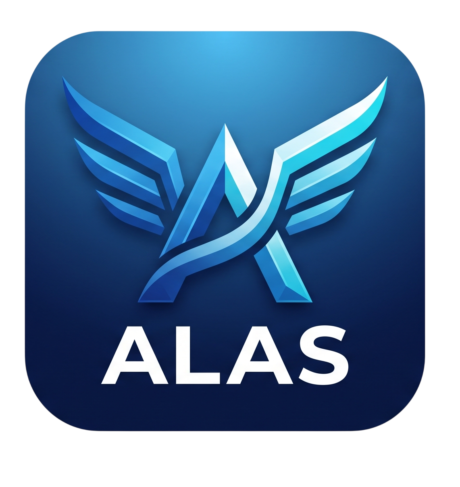

<p align="center">
  
</p>

# ALAS

**Aircraft Layout, Analysis and Sizing** — a conceptual aircraft design
environment. You supply mission requirements; ALAS sizes and optimizes the
airframe to meet them, then runs a full multidisciplinary analysis of the
result.

```
  requirements  ─►  sizing + optimization  ─►  analysis  ─►  report / export
  (what it must do)   (SciPy DE + VLM)     (aero, mass,     (JSON, .dat,
                                            stability,       figures, PDF)
                                            structures,
                                            propulsion,
                                            mission)
```

*Formerly released as AeroForge.*

---

## Quick start

Requires Python 3.10+ and [uv](https://docs.astral.sh/uv/).

```bash
uv sync                                              # install
uv run alas -c configs/example_config.yaml --plots   # optimize + analyze
```

Artifacts land in `./outputs/`: a design database (`design_data.json`), the
optimized root airfoil (`.dat`), and figures.

```bash
uv run alas --no-optimize --plots          # analyze the nominal design only
uv run alas --save-config my_design.yaml   # write a full editable config
uv run alas --seed 42 -c my_design.yaml    # reproducible optimizer run
```

### Desktop application

A Wails + React desktop shell wraps the same pipeline, adding live 3-D
previews, an airfoil screening sweep, and interactive result figures.

```bash
cd desktop && wails dev      # requires Go 1.22+, Node 20+, Wails v2
```

Prebuilt binaries are on the [releases page](https://github.com/MarcosQuirogaR/ALAS/releases).

### As a library

```python
from alas import ALASConfig, DesignPipeline

config = ALASConfig.from_yaml("configs/example_config.yaml")
result = DesignPipeline(config).run(make_plots=False)

print(result.optimized_report.design_point)  # cruise alpha, CL, CD, L/D
print(result.optimized_design.span_m)  # winning geometry, by name
```

---

## What it computes

| Discipline | Method |
|---|---|
| Aerodynamics | Vortex-lattice (AeroSandbox) + Raymer parasite drag + Korn wave drag |
| Mass & balance | Torenbeek/Raymer component build-up, CG envelope, loading diagram |
| Stability | Static margin, trim, control surfaces, dynamic modes |
| Structures | Wingbox FEM with any spar count; analytical estimates always available |
| Propulsion | Turbofan cycle analysis, carpet plots, BPR sensitivity |
| Mission | Climb/cruise/descent simulation via SUAVE, with real airway routing |
| Airfoil selection | Two-stage screening of ~1,600 UIUC sections (2-D, then 3-D VLM re-rank) |

Every model, equation, and its controlling config field is documented in
[`docs/methods.md`](docs/methods.md).

---

## Optional external tools

ALAS runs fully without any of these. Each unlocks additional fidelity, and
each is licensed separately by its own vendor — none is distributed with ALAS.
Configure them under **Setup → External Tools**, or in your config YAML.

| Tool | Adds | Without it |
|---|---|---|
| [MSES](https://web.mit.edu/drela/Public/web/mses/) | Coupled viscous/inviscid 2-D airfoil analysis | The Model Comparison tab omits the MSES column |
| [MSC Nastran](https://hexagon.com/) | FEM wingbox solve | Analytical deflection/stress estimates are used |
| [MSC Patran](https://hexagon.com/) | Deformation plot export | No plot export |
| [Enroute navdata](https://github.com/mcantsin/x-plane-navdata) | Real waypoint/airway routes | Routes are great circles |

The navdata is **GPL-3.0** and therefore not shipped. Fetch it on request from
Setup → External Tools, or:

```bash
uv run python scripts/download_navdata.py
```

SUAVE mission analysis needs an isolated Python 3.10 environment, since it
requires an older numpy/scipy stack:

```bash
uv run python scripts/provision_suave_venv.py    # one-time, ~2 min
```

A packaged build bundles that runtime and extracts it on first launch.

---

## Project layout

```
alas/
├── config/        Typed, documented dataclasses -- every tunable input
├── geometry/      Airfoil shaping, parametric aircraft assembly, FEM meshing
├── physics/       Aerodynamics, mass, stability, structures, propulsion, cabin
├── optimization/  Objective function + differential-evolution driver
├── analysis/      Full evaluation of a final design; airfoil screening
├── integration/   SUAVE, NASTRAN and Patran bridges; downloadable assets
├── routing/       SimBrief / open-navdata airways / great-circle routing
├── reporting/     Figure factories, JSON and .dat export, 3-D route globe
├── sidecar/       FastAPI server backing the desktop application
├── pipeline.py    Orchestrates the whole workflow
└── cli.py         Command-line front-end
desktop/           Wails (Go) shell + React frontend
external tools/    Vendored SUAVE 2.5.2 + the SUAVE runner
docs/              Architecture and methods
tests/             Test suite (pytest)
```

---

## Documentation

| Document | Purpose |
|---|---|
| [`docs/architecture.md`](docs/architecture.md) | How the pipeline fits together, module by module |
| [`docs/methods.md`](docs/methods.md) | Every formula and solver, with references |
| [`CONTRIBUTING.md`](CONTRIBUTING.md) | Development setup, code style, how to propose a change |

---

## Design principles

- **No hardcoded design values.** Anything a user might tune lives in a
  `config/` dataclass and can be set from YAML.
- **UI-agnostic core.** The pipeline knows nothing about how it is driven, so
  the CLI, the sidecar and any future front-end share one implementation.
- **Named reference data, not magic numbers.** Empirical coefficients and
  geometry scaffolds cite their source.
- **Degrade honestly.** A missing external tool produces a clear message and a
  documented fallback, never a silent wrong answer.

---

## Contributing

Contributions are welcome — see [`CONTRIBUTING.md`](CONTRIBUTING.md) for setup,
style, and the review process. All changes are reviewed before merging; see
[`GOVERNANCE.md`](GOVERNANCE.md).

To report a security issue, follow [`SECURITY.md`](SECURITY.md) rather than
opening a public issue.

---

## Licence

Copyright © 2026 Marcos Quiroga Rodríguez.
Licensed under **AGPL-3.0-or-later** — see [`LICENSE`](LICENSE).

If you distribute ALAS, or make a modified version available over a network,
you must publish your source under the same licence. Commercial licences are
available on request; see [`NOTICE`](NOTICE).

Third-party components and their licences are listed in
[`THIRD-PARTY-NOTICES.md`](THIRD-PARTY-NOTICES.md).

## Citing ALAS

If ALAS contributes to work you publish, please cite it — see
[`CITATION.cff`](CITATION.cff), or use GitHub's *Cite this repository* button.
