# Gallery

Output of the pipeline across the disciplines. Click any figure to view it full size.

!!! note "Reference design output"
    One run of the registered AVE preset (optimization on, seed 42, vortex-lattice aerodynamics) with MSES,
    AVL, MSC Nastran, NASTRAN-95 and Patran enabled and the mission flown over a SimBrief plan from EGLL to OMDB.
    All figures use the dark theme. The OpenVSP and VSPAERO figures come from a replay of the same delivered design. FLOWUnsteady is not installed and has no figures.
    Each figure is explained in its walkthrough chapter.

## Geometry and configuration

The aircraft as built from the design vector.

<figure markdown>
  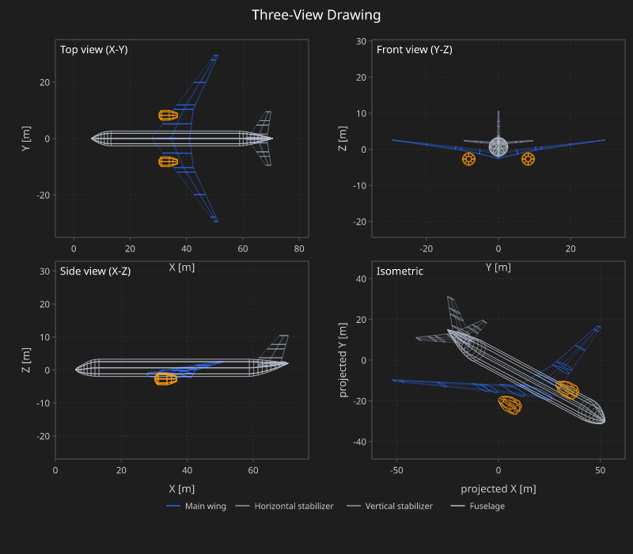
  <figcaption><strong>Three-view</strong>. Top, front, side and isometric views of the optimized aircraft.</figcaption>
</figure>

<figure markdown>
  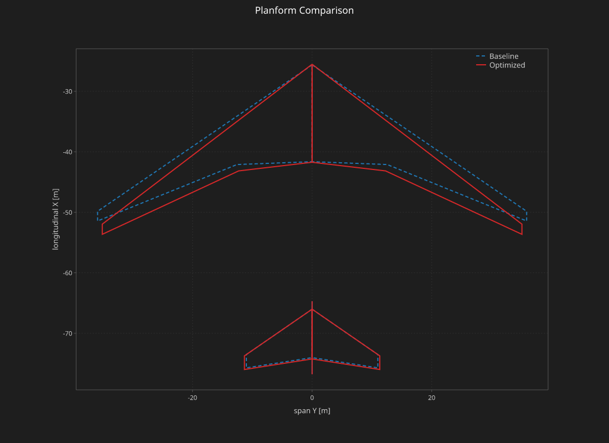
  <figcaption><strong>Planform comparison</strong>. Baseline preset (dashed) and optimized (solid) wing and tail planform on the same scale.</figcaption>
</figure>

<figure markdown>
  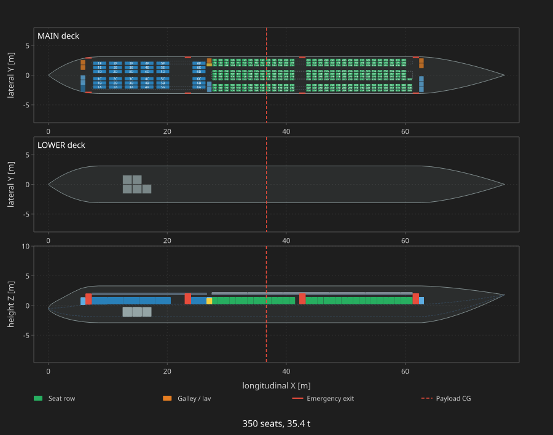
  <figcaption><strong>Cabin and payload</strong>. Seat map, hold containers and the payload centre of gravity: 350 seats, 35.4 t payload.</figcaption>
</figure>

<figure markdown>
  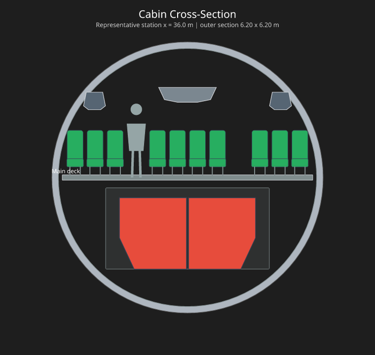
  <figcaption><strong>Cabin cross-section</strong>. Seats, aisle, overhead bins and lower-deck containers inside the 6.20 m by 6.20 m outer fuselage section.</figcaption>
</figure>

<figure markdown>
  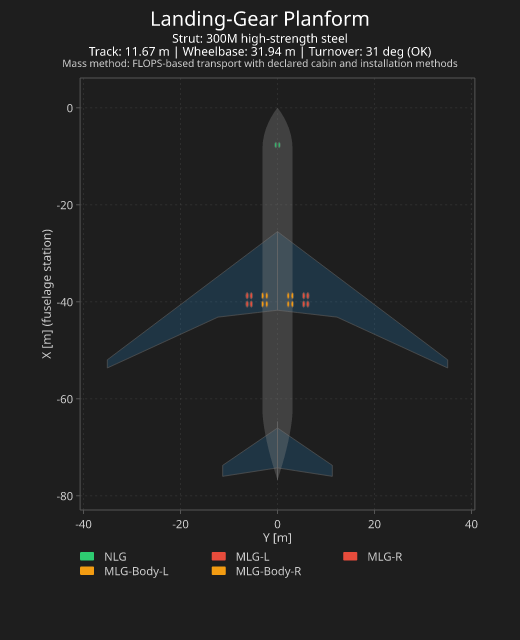
  <figcaption><strong>Landing gear</strong>. Gear layout: track 11.67 m, wheelbase 31.94 m, turnover angle 31 deg (within limit).</figcaption>
</figure>

## Optimization

What the search evaluated and where it ended.

<figure markdown>
  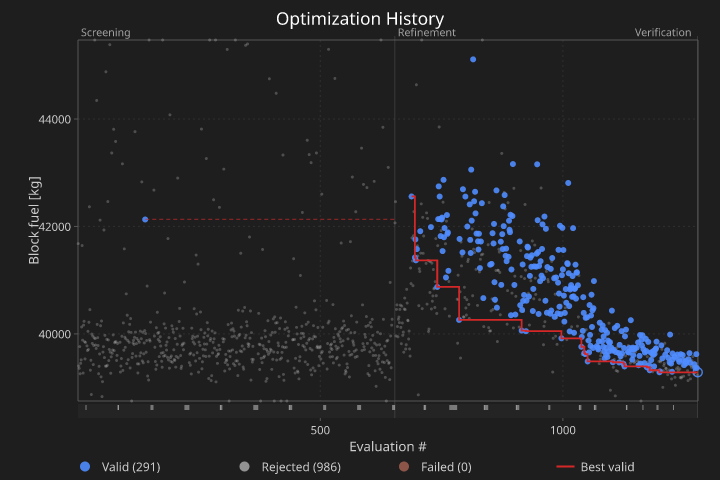
  <figcaption><strong>Convergence</strong>. Block fuel against evaluation number through screening, refinement and verification: 1,277 evaluations, 291 valid, 986 rejected, none failed. The best valid candidate is at about 39.3 t.</figcaption>
</figure>

<figure markdown>
  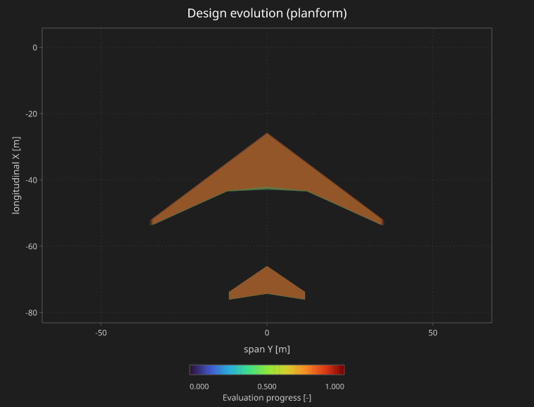
  <figcaption><strong>Design evolution</strong>. Planforms of the valid evaluations overlaid and coloured by evaluation order.</figcaption>
</figure>

<figure markdown>
  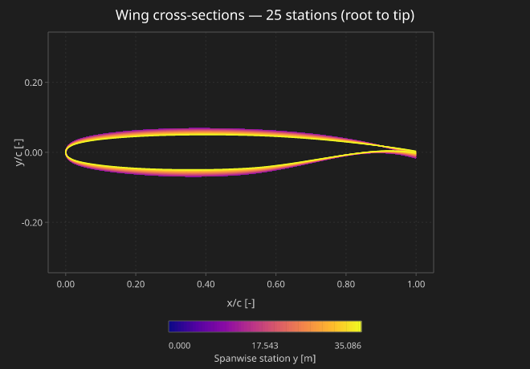
  <figcaption><strong>Section evolution</strong>. Wing cross-sections at 25 spanwise stations from root to tip.</figcaption>
</figure>

<figure markdown>
  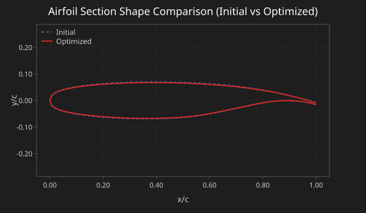
  <figcaption><strong>Root airfoil</strong>. Initial and optimized root sections (camber scale 0.98, thickness scale 0.97).</figcaption>
</figure>

<figure markdown>
  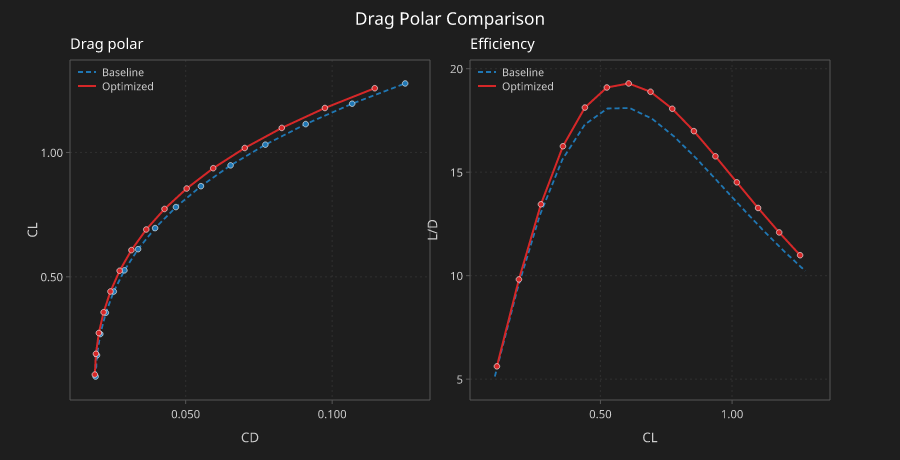
  <figcaption><strong>Polar comparison</strong>. Drag polar and L/D of the baseline and optimized designs; peak L/D about 19.3 against about 18.1.</figcaption>
</figure>

## Aerodynamics

Vortex-lattice results with viscous and wave-drag corrections.

<figure markdown>
  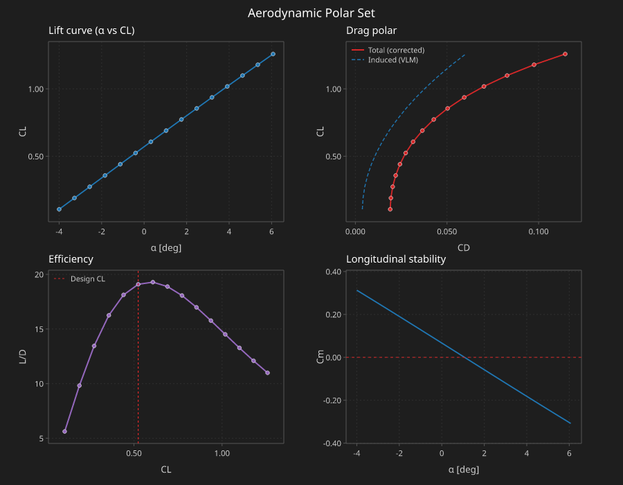
  <figcaption><strong>Aerodynamic sweep</strong>. Lift curve, drag polar, L/D and pitching moment. Design CL 0.524 at L/D 19.09.</figcaption>
</figure>

<figure markdown>
  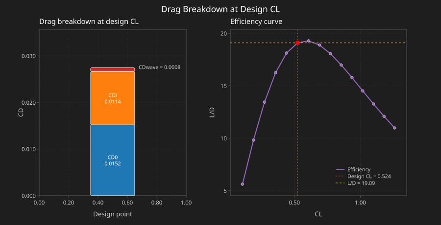
  <figcaption><strong>Drag breakdown</strong>. Drag at the design CL: CD0 0.0152, induced CDi 0.0114, wave CDwave 0.0008.</figcaption>
</figure>

<figure markdown>
  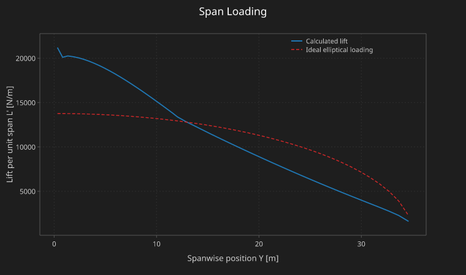
  <figcaption><strong>Span loading</strong>. Spanwise lift distribution against the elliptical reference.</figcaption>
</figure>

<figure markdown>
  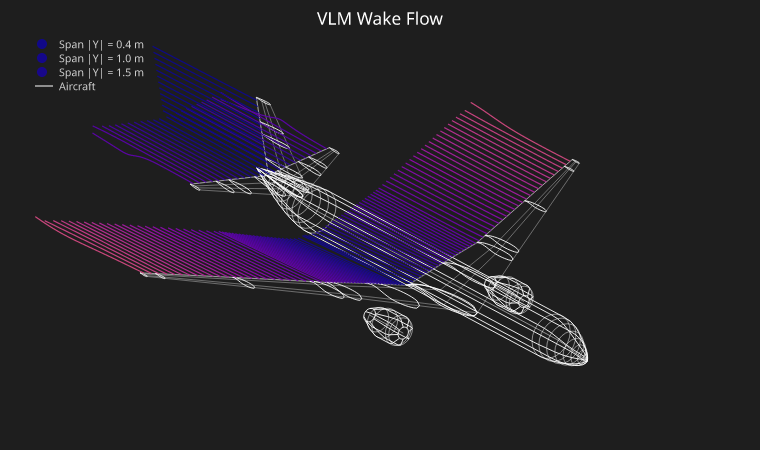
  <figcaption><strong>Flow visualisation</strong>. Streamlines and surface loading from the vortex-lattice solve.</figcaption>
</figure>

<figure markdown>
  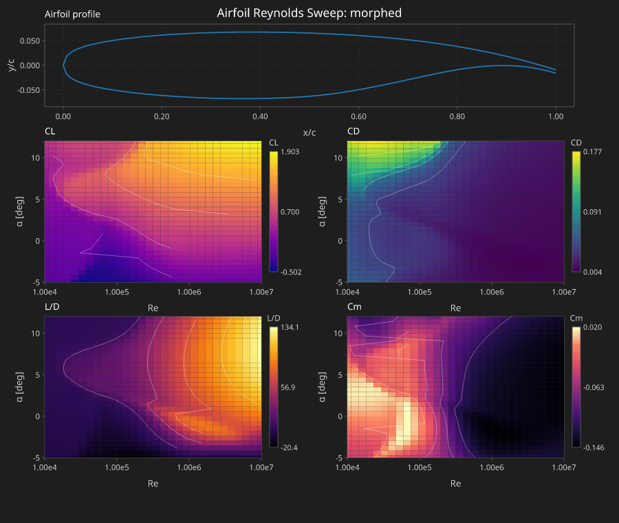
  <figcaption><strong>Section against Reynolds number</strong>. Two-dimensional section behaviour across Reynolds number and angle of attack.</figcaption>
</figure>

<figure markdown>
  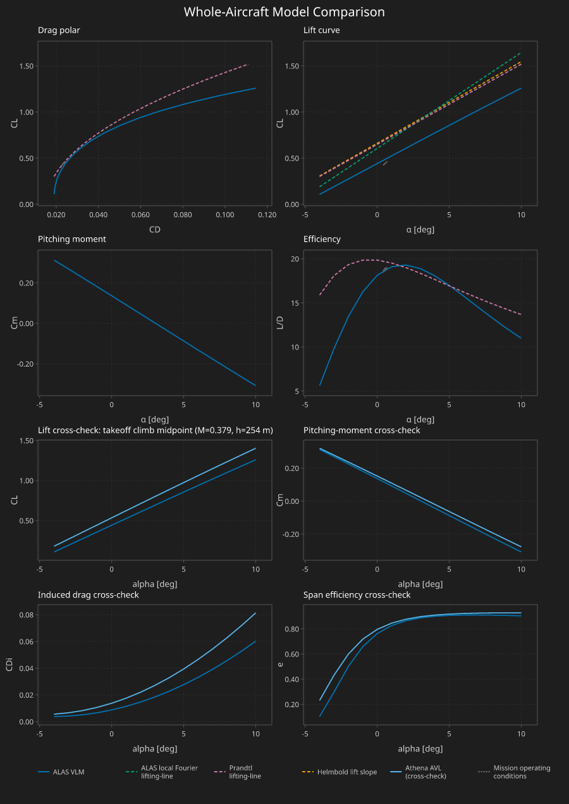
  <figcaption><strong>Model comparison</strong>. ALAS vortex-lattice, local Fourier lifting-line, Prandtl lifting-line and the Helmbold lift slope on shared axes, with the AVL cross-check in the lower four panels.</figcaption>
</figure>

## Athena Vortex Lattice (AVL)

AVL 3.52 runs on the optimized geometry at the take-off climb midpoint (Mach 0.379, 254 m), 15 angle-of-attack cases, 284 strips.

<figure markdown>
  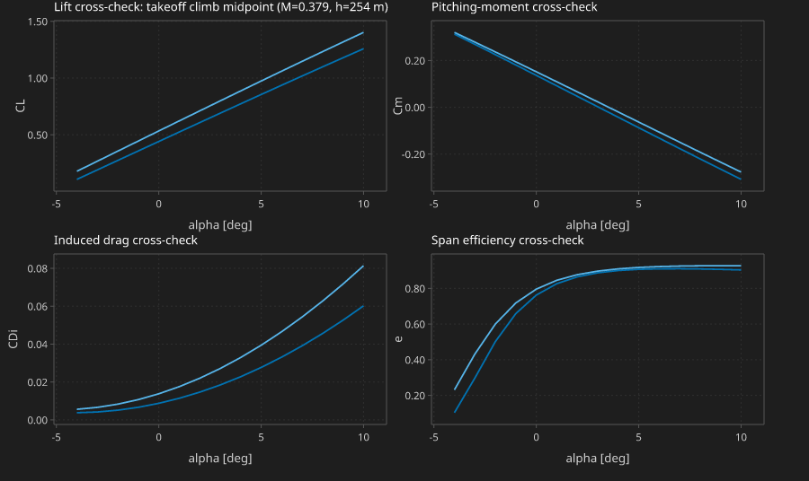
  <figcaption><strong>ALAS and AVL</strong>. Lift, pitching moment, induced drag and span efficiency against angle of attack: ALAS vortex-lattice (lower curve in lift and induced drag) and AVL (upper curve). Lower four panels of the model comparison above.</figcaption>
</figure>

## OpenVSP and VSPAERO

OpenVSP 3.51.2 builds the .vsp3 model and CAD preview of the delivered design (same geometry as the figures above: span 70.17 m, S_ref 531.4 m2), and VSPAERO 3.51.2 runs a vortex-lattice sweep from alpha -4 to 10 deg. VSPAERO ended with its wake not converged (5 wake iterations, final coefficient change 5e-3 to 3.6e-2 against the 1e-4 tolerance), so the app marks the result as not comparable to the native solver.

<figure markdown>
  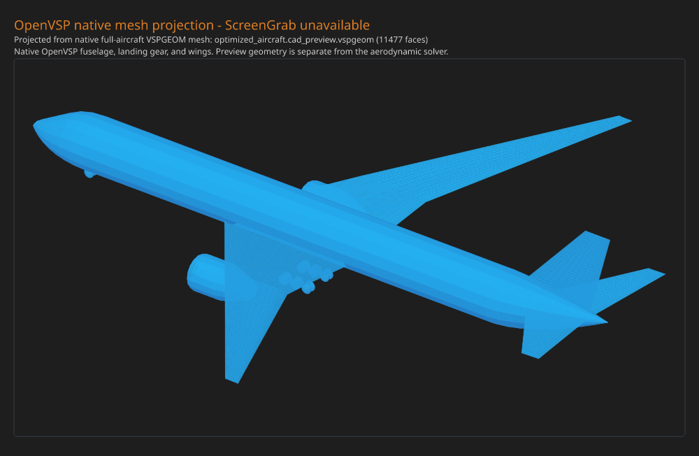
  <figcaption><strong>OpenVSP model</strong>. Native OpenVSP mesh projection of the full aircraft (fuselage, gear, engines, wing and tail), 11,477 faces. The preview geometry is separate from the aerodynamic solver.</figcaption>
</figure>

<figure markdown>
  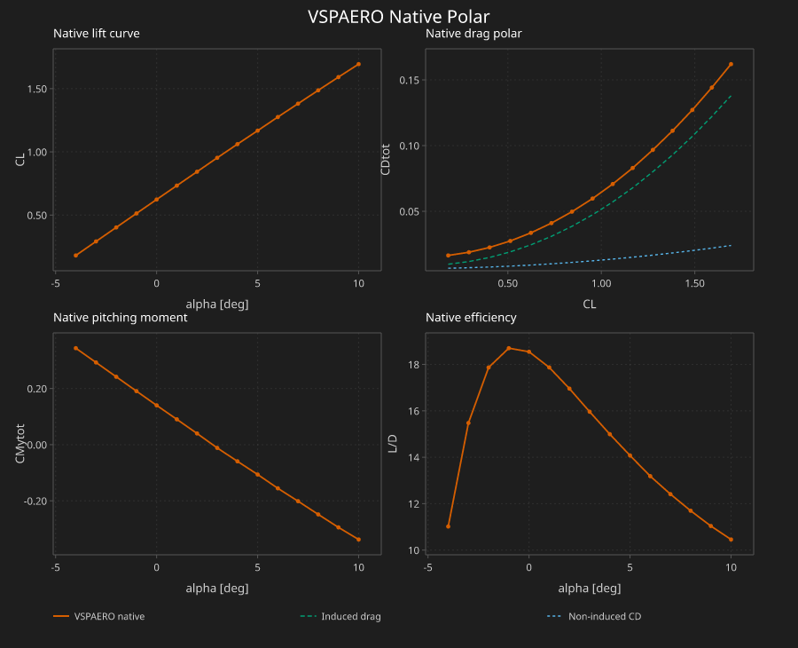
  <figcaption><strong>VSPAERO polar</strong>. Lift curve, drag polar, pitching moment and L/D: CL 0.62 at alpha 0 deg, peak L/D about 18.7 near alpha -1 deg.</figcaption>
</figure>

<figure markdown>
  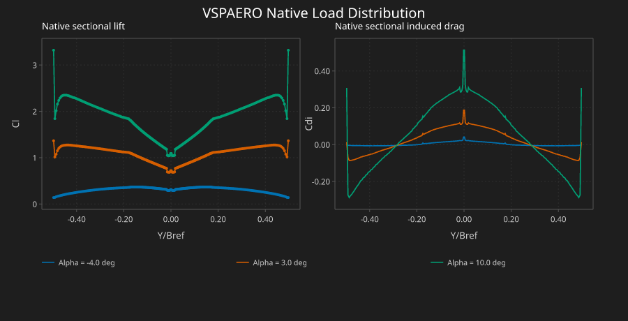
  <figcaption><strong>VSPAERO load distribution</strong>. Sectional lift and induced-drag coefficient along the span at alpha -4, 3 and 10 deg.</figcaption>
</figure>

<figure markdown>
  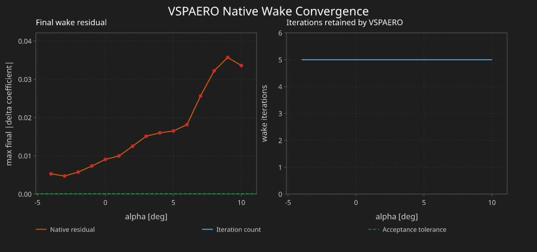
  <figcaption><strong>VSPAERO wake convergence</strong>. Final wake residual and iteration count per angle of attack against the 1e-4 acceptance tolerance: the residual grows from 5e-3 at alpha -4 deg to 3.6e-2 at alpha 9 deg, with 5 wake iterations in every case.</figcaption>
</figure>

## Transonic section analysis (MSES)

MSES 3.12 on the optimized root section at Mach 0.69 (cruise Mach 0.84 normal to the quarter-chord line) and Reynolds number 7.6e7. Two of the seven sweep points converged (alpha 5.06 and 6.06 deg). The section is past its lift peak there, with CL 1.15 and 1.08 and CD 0.077 and 0.091, so these are not representative cruise points.

<figure markdown>
  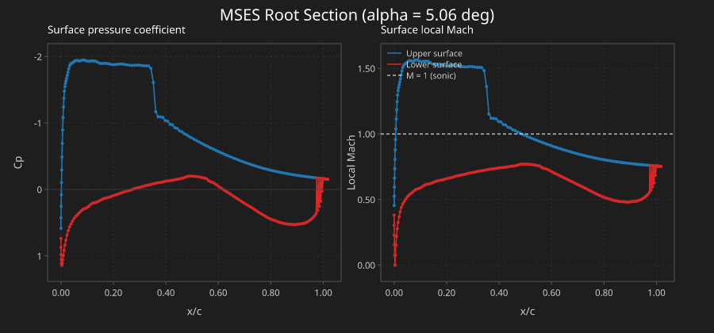
  <figcaption><strong>Surface pressure and Mach</strong>. Cp and local Mach on the root section at alpha 5.06 deg: supersonic upper surface ending in a shock near x/c 0.35.</figcaption>
</figure>

<figure markdown>
  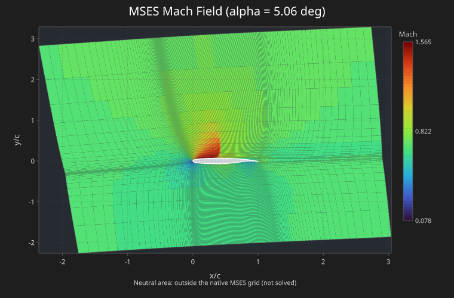
  <figcaption><strong>Mach field</strong>. The supersonic pocket over the upper surface in the MSES grid; peak Mach 1.565.</figcaption>
</figure>

<figure markdown>
  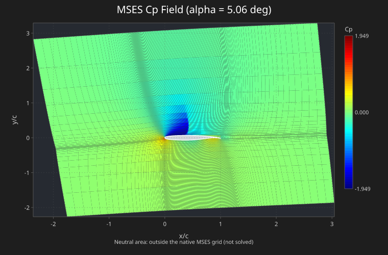
  <figcaption><strong>Cp field</strong>. Pressure-coefficient field around the root section.</figcaption>
</figure>

<figure markdown>
  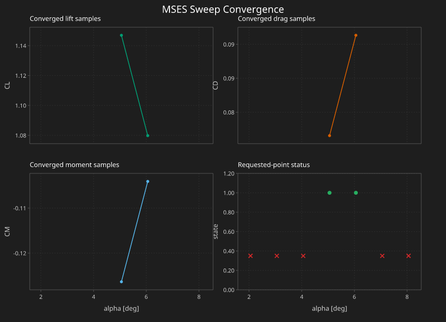
  <figcaption><strong>Sweep convergence</strong>. Converged lift, drag and moment samples and the status of each requested point: 2 of 7 converged with 300 solver iterations.</figcaption>
</figure>

## Structures

Analytical wingbox sizing for the governing load case, with MSC Nastran 2026.1 (Student Edition) and NASTRAN-95 finite-element solutions of the same wing model, and Patran renders.

<figure markdown>
  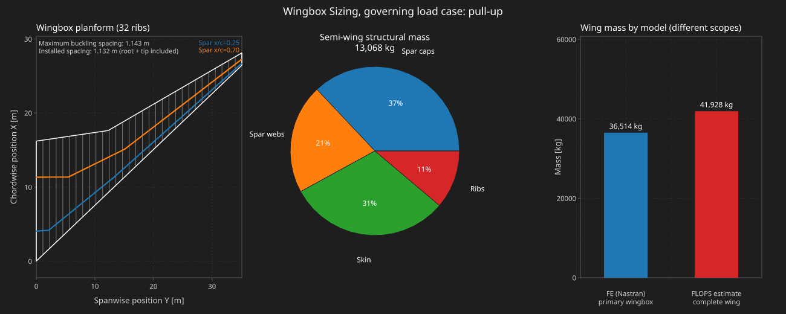
  <figcaption><strong>Wingbox sizing</strong>. Pull-up sizing with 32 ribs: semi-wing structural mass 13,068 kg; FE primary wingbox 36,514 kg against the FLOPS complete-wing estimate of 41,928 kg (different scopes).</figcaption>
</figure>

<figure markdown>
  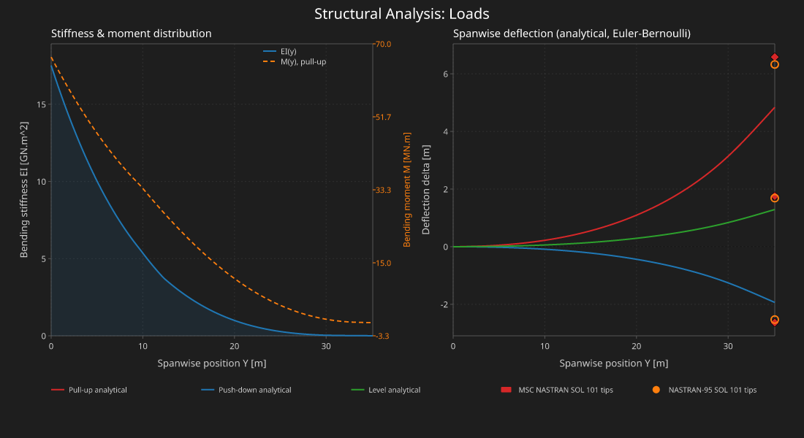
  <figcaption><strong>Loads and deflection</strong>. Bending stiffness and pull-up moment (peak about 70 MN.m) and spanwise deflection. Markers at the tip are the SOL 101 results: about 6.6 m (MSC Nastran) and 6.3 m (NASTRAN-95) in pull-up against 4.8 m from the analytical beam.</figcaption>
</figure>

<figure markdown>
  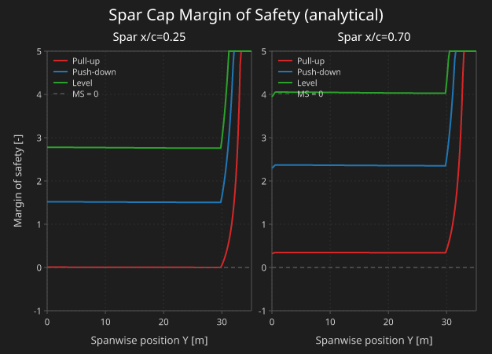
  <figcaption><strong>Margins of safety</strong>. Analytical spar-cap margin along the span at x/c 0.25 and 0.70: the pull-up case at the front spar is sized to MS = 0. The finite-element models report root stresses above the allowable (MSC Nastran 1.38 GPa pull-up, NASTRAN-95 0.74 GPa, against 480 MPa) and flag the candidate; those values need element-level review.</figcaption>
</figure>

<figure markdown>
  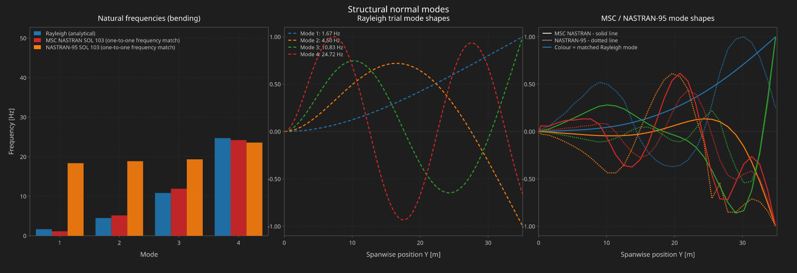
  <figcaption><strong>Natural modes</strong>. Bending frequencies from the Rayleigh estimate, MSC Nastran SOL 103 and NASTRAN-95 SOL 103 with their mode shapes. MSC Nastran gives about 1.2, 5.2, 12.0 and 24.3 Hz; NASTRAN-95 gives 18 to 24 Hz and does not reproduce the low modes.</figcaption>
</figure>

<figure markdown>
  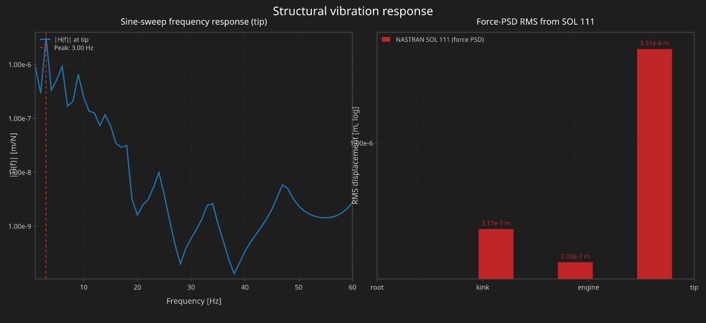
  <figcaption><strong>Vibration</strong>. Tip sine-sweep response and force-PSD RMS displacement from MSC Nastran SOL 111: tip peak at 3.0 Hz, RMS displacement 3.5e-6 m at the tip.</figcaption>
</figure>

<figure markdown>
  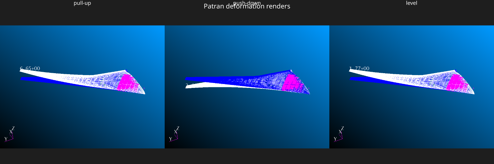
  <figcaption><strong>Patran deformation renders</strong>. Patran renders of the SOL 101 pull-up, push-down and level cases (deformed against undeformed model).</figcaption>
</figure>

## Propulsion

Engine cycle and installed performance for the GE9X.

<figure markdown>
  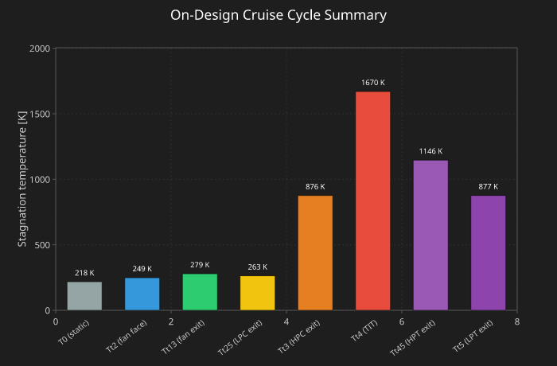
  <figcaption><strong>Cycle summary</strong>. On-design cruise stagnation temperatures: T0 218 K, Tt2 249 K, Tt3 876 K, Tt4 1670 K, Tt45 1146 K, Tt5 877 K.</figcaption>
</figure>

<figure markdown>
  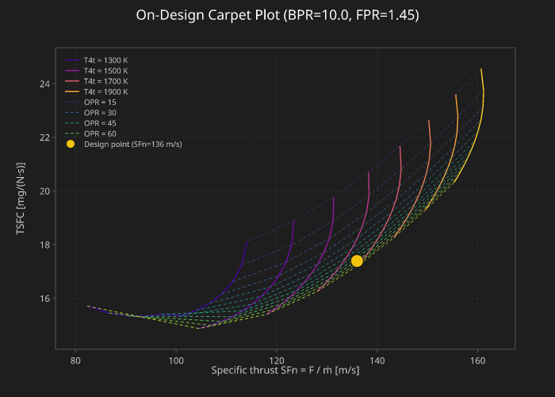
  <figcaption><strong>Carpet plot</strong>. Fuel consumption against specific thrust across pressure ratio and turbine temperature.</figcaption>
</figure>

<figure markdown>
  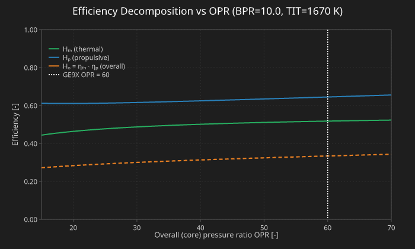
  <figcaption><strong>Efficiency decomposition</strong>. Thermal, propulsive and overall efficiency against pressure ratio.</figcaption>
</figure>

<figure markdown>
  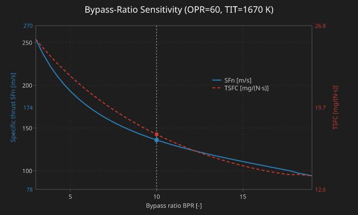
  <figcaption><strong>Bypass sensitivity</strong>. Specific thrust and fuel consumption against bypass ratio.</figcaption>
</figure>

<figure markdown>
  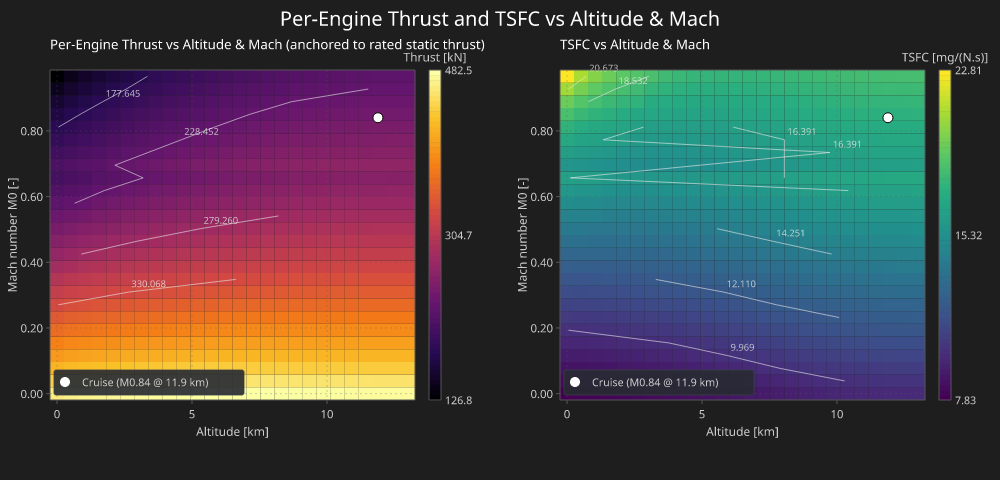
  <figcaption><strong>Altitude and Mach</strong>. Thrust and TSFC over altitude and Mach, anchored to the rated static thrust; cruise point Mach 0.84 at 11.9 km.</figcaption>
</figure>

## Weight, balance and stability

<figure markdown>
  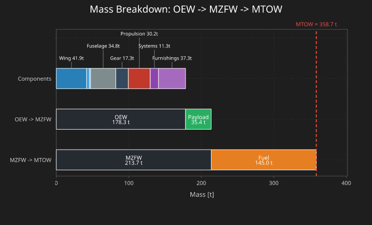
  <figcaption><strong>Mass breakdown</strong>. OEW 178.3 t, payload 35.4 t, fuel 145.0 t, MTOW 358.7 t. Components: wing 41.9 t, fuselage 34.8 t, gear 17.3 t, propulsion 30.2 t, systems 11.3 t, furnishings 37.3 t.</figcaption>
</figure>

<figure markdown>
  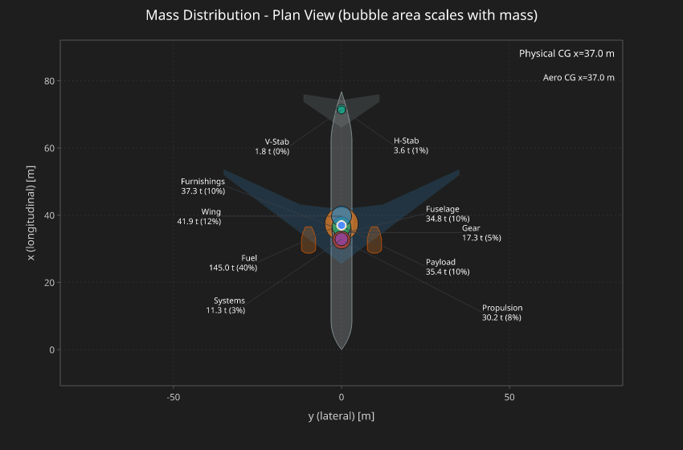
  <figcaption><strong>Mass distribution</strong>. Plan-view mass bubbles and the centre of gravity (x = 37.0 m).</figcaption>
</figure>

<figure markdown>
  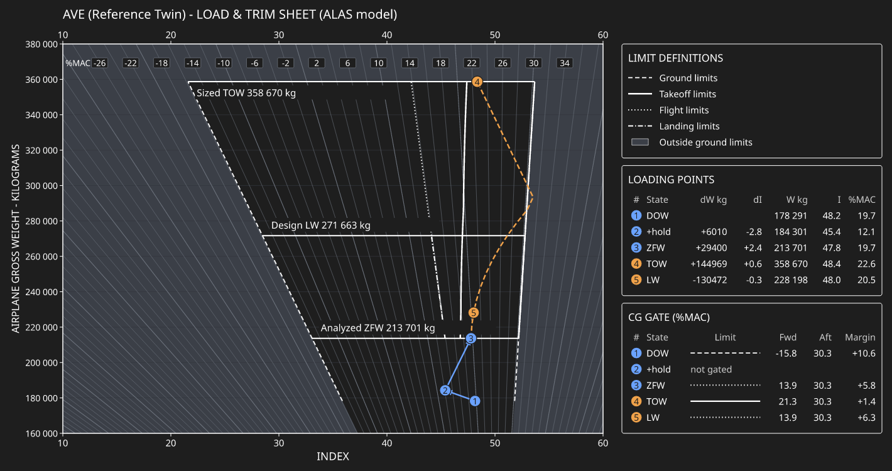
  <figcaption><strong>Load and trim sheet</strong>. Gross weight against index with the CG in %MAC, loading points and CG gate: DOW 178,291 kg, ZFW 213,701 kg, TOW 358,670 kg, LW 228,198 kg. Gate margins from +1.4 %MAC (TOW) to +10.6 %MAC (DOW).</figcaption>
</figure>

<figure markdown>
  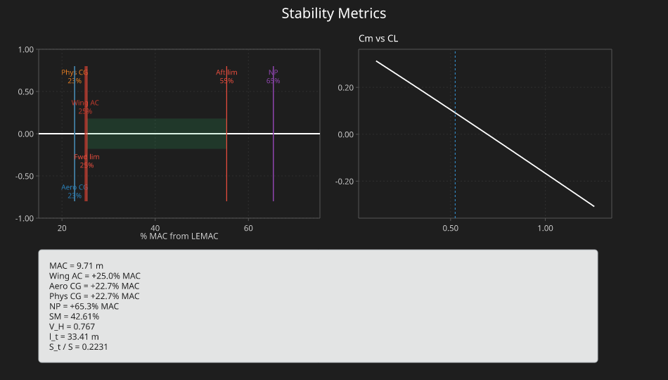
  <figcaption><strong>Stability metrics</strong>. MAC 9.71 m, wing AC 25.0 %MAC, CG 22.7 %MAC, neutral point 65.3 %MAC, static margin 42.6 %, Vh 0.767, tail arm 33.41 m.</figcaption>
</figure>

<figure markdown>
  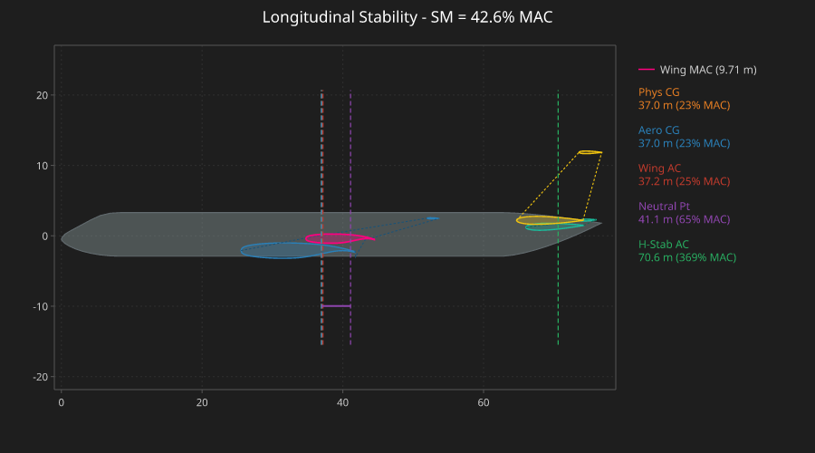
  <figcaption><strong>Stability on the airframe</strong>. The same stations drawn on the side view.</figcaption>
</figure>

<figure markdown>
  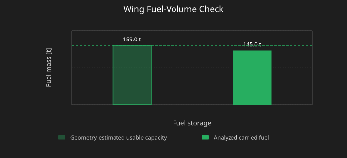
  <figcaption><strong>Fuel volume check</strong>. Geometry-estimated usable capacity 159.0 t against 145.0 t carried at MTOW.</figcaption>
</figure>

<figure markdown>
  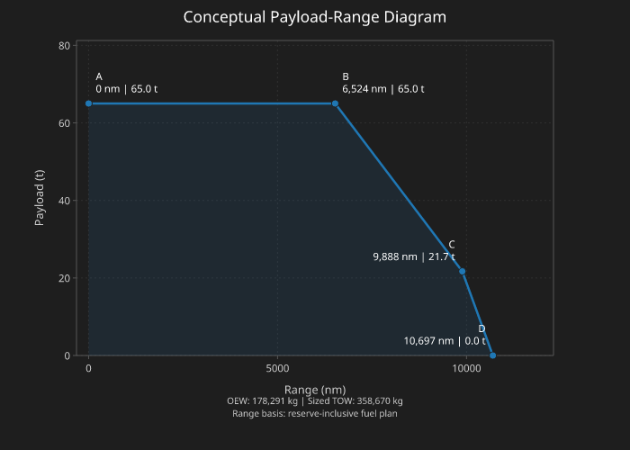
  <figcaption><strong>Payload-range</strong>. A 0 nmi at 65.0 t; B 6,524 nmi at 65.0 t; C 9,888 nmi at 21.7 t; D 10,697 nmi at 0 t (reserve-inclusive fuel plan).</figcaption>
</figure>

<figure markdown>
  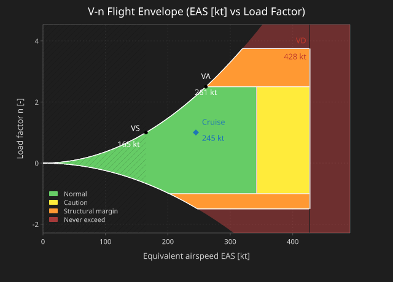
  <figcaption><strong>V-n envelope</strong>. Manoeuvre envelope in equivalent airspeed: VS 165 kt, VA 261 kt, VD 428 kt, cruise 245 kt, limit load factors +2.5 and -1.0.</figcaption>
</figure>

<figure markdown>
  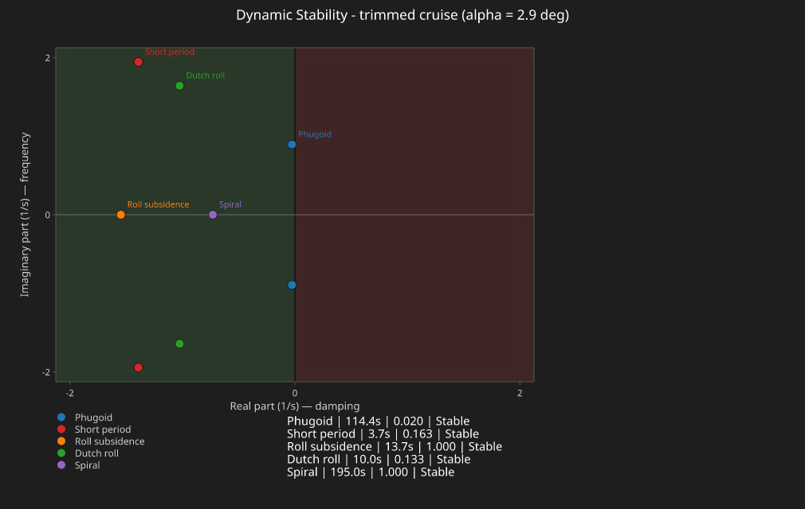
  <figcaption><strong>Dynamic modes</strong>. Trimmed cruise at alpha 2.9 deg, all stable: short period 3.7 s (zeta 0.163), phugoid 114.4 s (0.020), Dutch roll 10.0 s (0.133), roll 13.7 s, spiral 195.0 s.</figcaption>
</figure>

<figure markdown>
  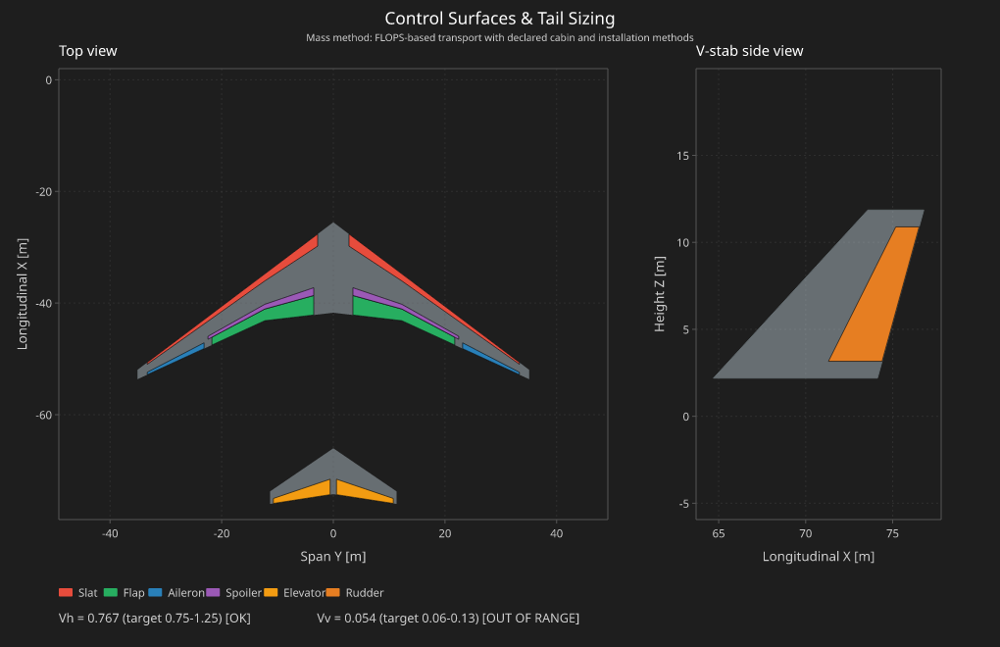
  <figcaption><strong>Control surfaces</strong>. Slat, flap, aileron, spoiler, elevator and rudder with tail-volume checks: Vh 0.767 within target, Vv 0.054 below the 0.06 to 0.13 target.</figcaption>
</figure>

## Low-speed and field performance

<figure markdown>
  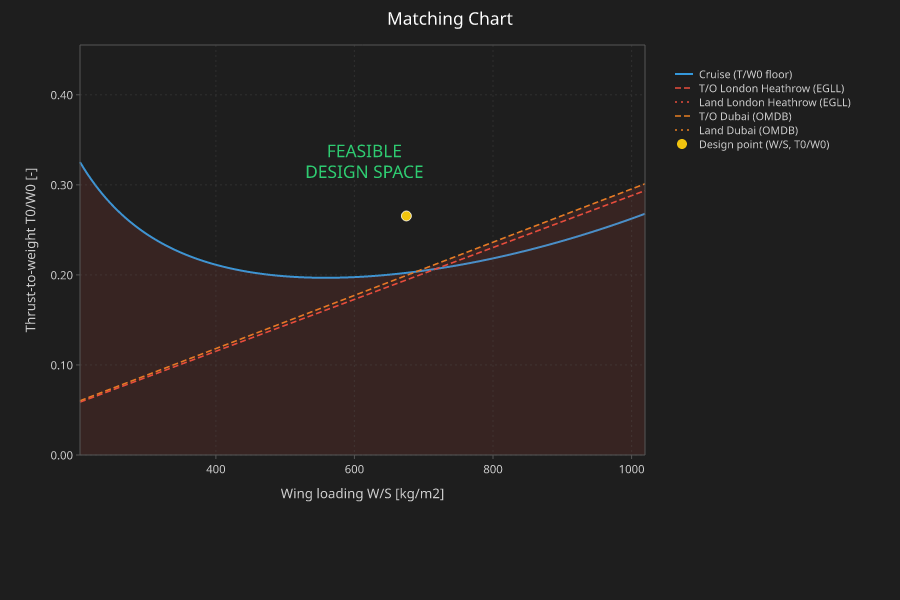
  <figcaption><strong>Matching chart</strong>. Thrust-to-weight against wing loading with the cruise floor and the Heathrow and Dubai take-off and landing constraints. Design point W/S about 675 kg/m2, T0/W0 about 0.265, inside the feasible region.</figcaption>
</figure>

<figure markdown>
  
  <figcaption><strong>Take-off, departure</strong>. London Heathrow (EGLL, ISA+0): TODR 2,857 m of 3,902 m available; V1 158 kt, VR 166 kt, V2 168 kt; LFL 1,456 m.</figcaption>
</figure>

<figure markdown>
  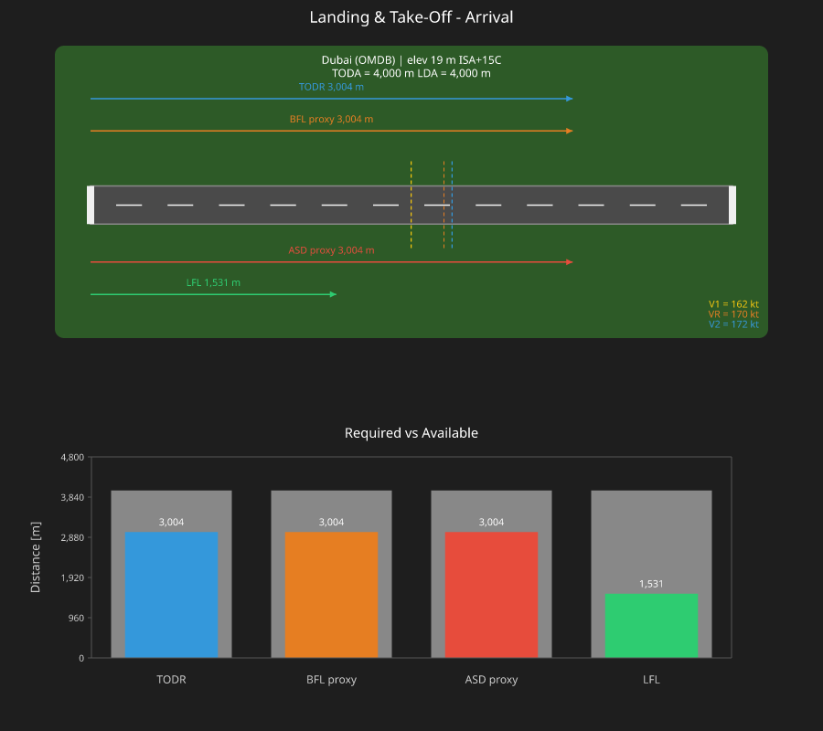
  <figcaption><strong>Landing, arrival</strong>. Dubai (OMDB, elevation 19 m, ISA+15): LFL 1,531 m against 4,000 m available. The take-off bars of this panel show 3,004 m.</figcaption>
</figure>

## Mission

The route is the latest SimBrief flight plan from London Heathrow (EGLL) to Dubai (OMDB): 89 waypoints, 6,362 km track.

<figure markdown>
  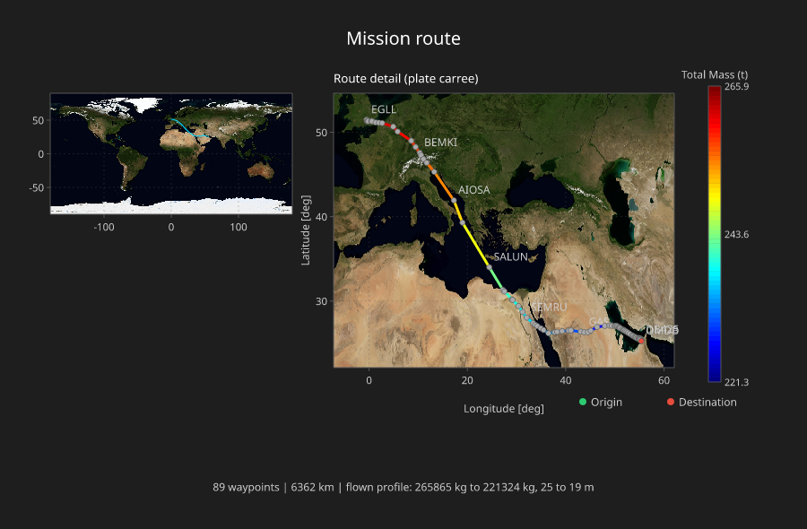
  <figcaption><strong>Ground track</strong>. The flown route coloured by aircraft mass (265.9 t to 221.3 t).</figcaption>
</figure>

<figure markdown>
  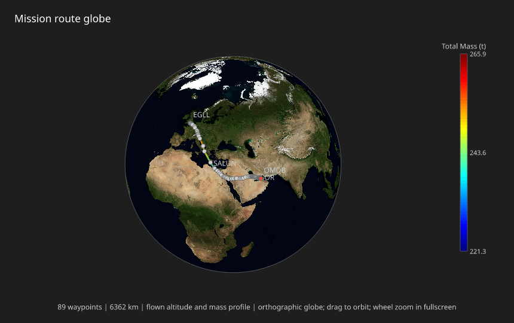
  <figcaption><strong>Route globe</strong>. The same route on the three-dimensional globe.</figcaption>
</figure>

<figure markdown>
  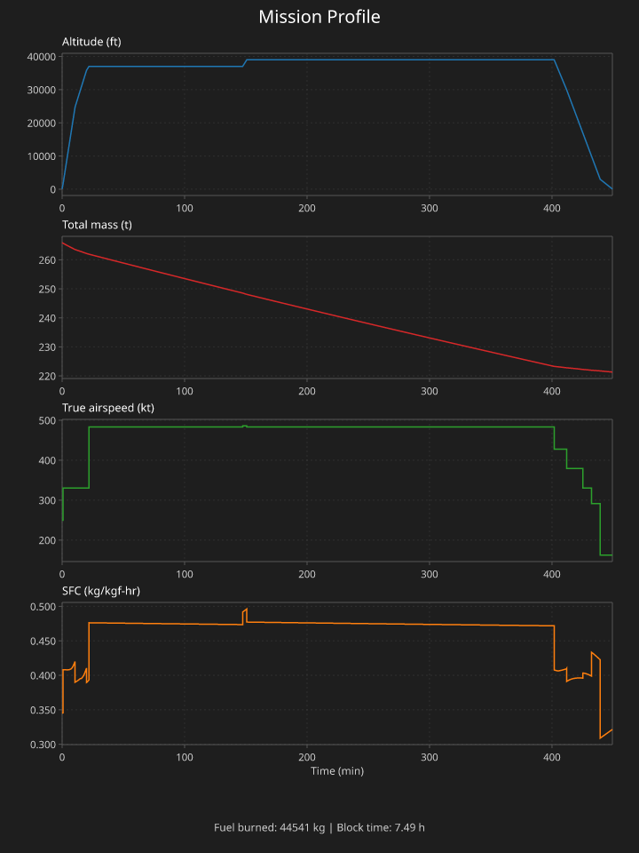
  <figcaption><strong>Mission profile</strong>. Altitude (FL370 then FL390), mass, true airspeed and SFC over a 7.49 h block; fuel burned 44,541 kg.</figcaption>
</figure>

<figure markdown>
  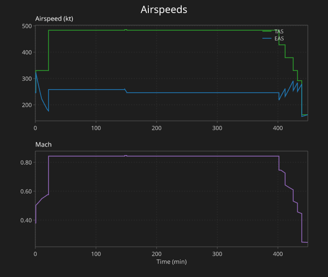
  <figcaption><strong>Airspeeds</strong>. True and equivalent airspeed and Mach; cruise Mach 0.84.</figcaption>
</figure>

<figure markdown>
  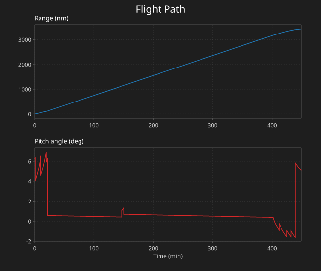
  <figcaption><strong>Flight path</strong>. Cumulative range and pitch attitude by segment.</figcaption>
</figure>

<figure markdown>
  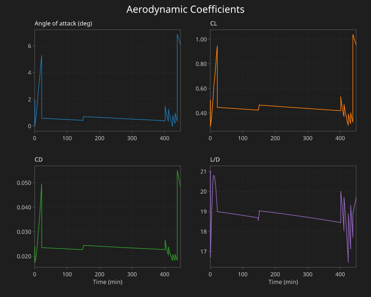
  <figcaption><strong>Coefficients in flight</strong>. CL, CD and L/D through the flight.</figcaption>
</figure>

<figure markdown>
  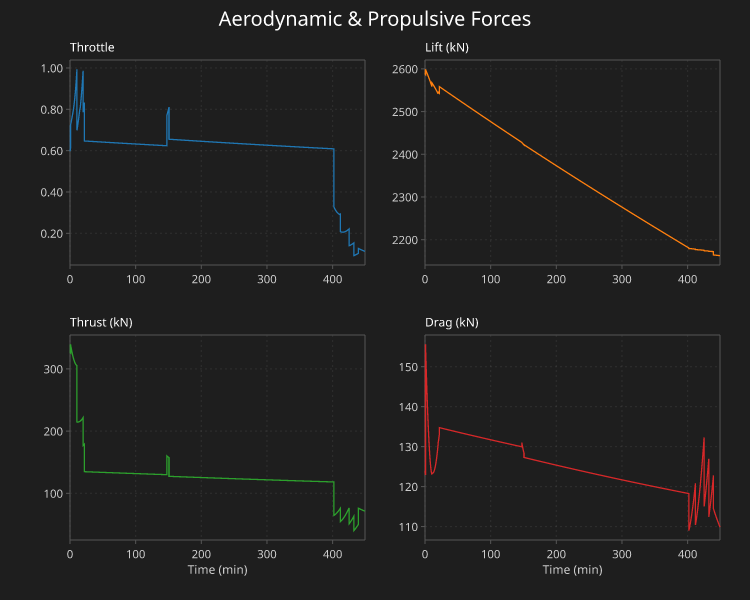
  <figcaption><strong>Forces in flight</strong>. Lift, drag and thrust at every step.</figcaption>
</figure>

<figure markdown>
  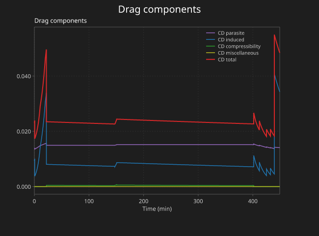
  <figcaption><strong>Drag components in flight</strong>. Parasite, induced and wave drag through the flight.</figcaption>
</figure>

## Airfoil CFD (OpenFOAM)

SC2-0714 at 2 deg angle of attack, chord 1 m, 51 m/s (Reynolds number 3.45e6, Mach 0.15), steady incompressible simpleFoam with k-omega SST on a Gmsh mesh of 182,319 cells (wall y+ about 1.0), rendered with ParaView. The run stopped at 2,000 iterations with the pressure residual at 2.4e-5 against a 1e-5 tolerance, so it is labelled unconverged and provisional in the image: Cl 0.767, Cd 0.0122.

<figure markdown>
  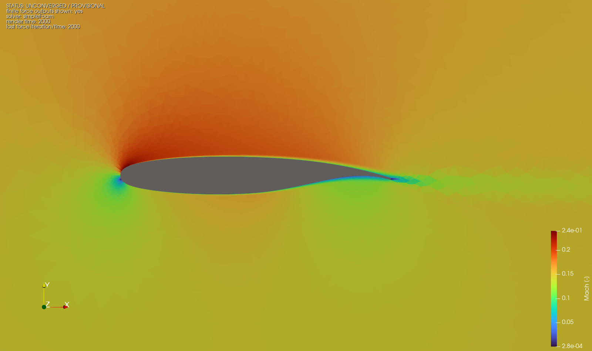
  <figcaption><strong>Mach contour</strong>. Mach number around the section. Maximum 0.24 on the upper surface.</figcaption>
</figure>

<figure markdown>
  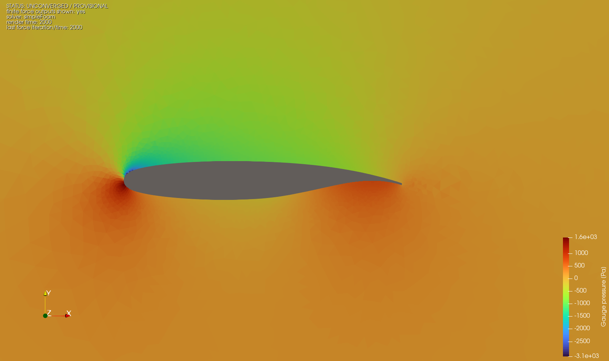
  <figcaption><strong>Pressure contour</strong>. Gauge pressure around the section, -3.1 kPa to 1.6 kPa.</figcaption>
</figure>

## Desktop application

Screenshots of the application with the AVE preset.

<figure markdown>
  
  <figcaption><strong>Inputs page</strong>. The AVE (Reference Twin) preset with the GE9X engine, Mach 0.84, 11,887 m and 350 passengers, the live 3D preview and the Design Wizard and Sandbox Mode switch.</figcaption>
</figure>

<figure markdown>
  
  <figcaption><strong>Results summary</strong>. Summary tab after a short-budget AVE optimization (240 + 160 evaluations) with every external tool on: block fuel 39,720 kg (-5.6 %), infeasible under implemented checks (4 blocking findings from the finite-element root-stress checks, 15 warnings). Cards: AVL success, MSES partially converged, MSC Nastran with a warning, OpenVSP, VSPAERO and FLOWUnsteady unavailable.</figcaption>
</figure>

<figure markdown>
  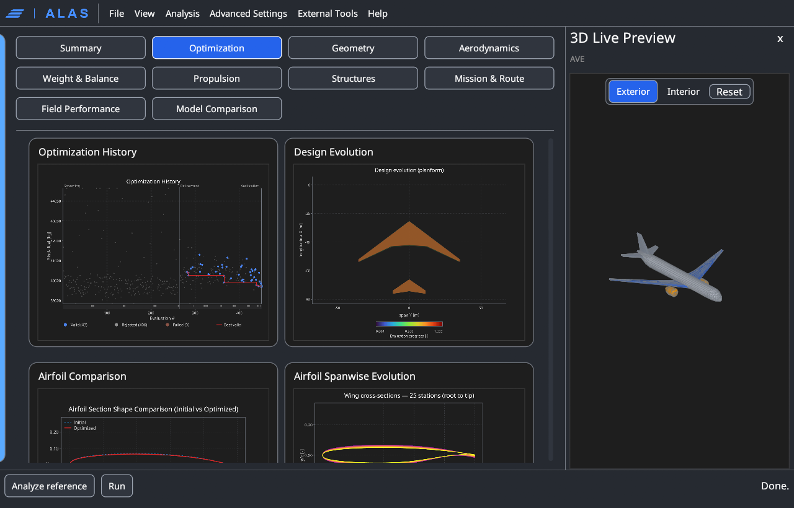
  <figcaption><strong>Optimization results</strong>. Optimization history, design evolution, airfoil comparison and spanwise airfoil evolution tiles.</figcaption>
</figure>
