# Sandbox mode

The sandbox is a full-window workspace for drawing an aircraft that is not in the
preset list. You start from AVE, reshape the wing, tails, fuselage and engines by
dragging handles or typing values, get fast estimates, and run the complete
analysis on the drawn geometry. A design worth keeping is promoted back to the
guided workspace as an editable baseline for the optimizer.

The [guided workspace](user-guide.md) protects the defining geometry of a
registered preset; the sandbox is where geometry is free. The sandbox uses the
same models as the rest of ALAS, so the same caveats apply: results are
conceptual-design estimates, and a drawn aircraft is no more credible than a
preset, only quicker to try.

## Why a separate mode

In the guided workspace a registered aircraft keeps its defining geometry: the
wing, empennage and fuselage definitions, the wetted-area factors and the
engine installation (count, spanwise placement, height and inlet offset). The
engine model itself (the catalogue entry) stays selectable. Every
configuration change and every run launch re-checks those fields and restores
them if something altered them, so a loaded file or a hidden path cannot bypass
the protection, and the log says so when it happens. The Geometry and Control
Surfaces tabs of Advanced Settings show a lock notice for the same reason.

The protection keeps a preset meaning what it says (an A320 stays an A320).

## Entering the sandbox

There are two ways in, both available from the guided workspace:

- **Inputs, Starting design card, Sandbox Mode.** The card offers
  **Design Wizard** (analyse or adapt a registered aircraft, geometry
  protected) beside **Sandbox Mode**.
- **File, Clean sheet design (sandbox).**

The first entry opens the **AVE reference**: AVE's geometry, requirements,
cabin, landing gear, mass model and performance settings, with the preset
identity cleared. Later entries **resume** the last sandbox or promoted custom
design. File, New sandbox from AVE (inside the sandbox) replaces the current
aircraft with a fresh AVE reference; the current design is not kept.

The sandbox cannot be entered while a run is in progress. Your guided case
(configuration, design vector, run log and results) is kept aside untouched
and comes back exactly as it was if you discard the sandbox.

!!! info "Every design variable is pinned"
    Inside the sandbox the sixteen [design variables](design-space-and-optimizer.md#sixteen-degrees-of-freedom)
    are held at the drawn values (the bounds collapse to a point), and the run
    never optimizes. The aircraft is analysed as drawn, never redesigned by a
    run.

## The workspace

<figure markdown>
  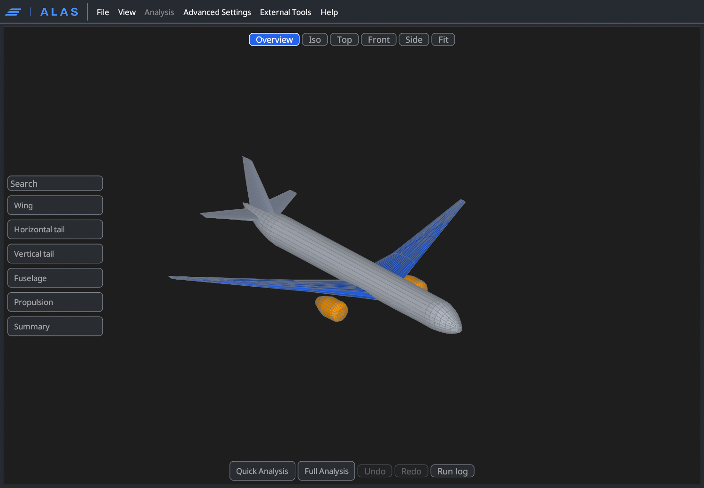
  <figcaption>The sandbox opened on the AVE reference: the 3D viewport with its floating controls.</figcaption>
</figure>

A menu bar and one large 3D viewport replace the navigation, content pane and
run dock. Every other control floats inside the viewport, dimmed until you point
at it.

| Control | Where | What it does |
|---|---|---|
| **Overview**, **Iso**, **Top**, **Front**, **Side**, **Fit** | Top of the viewport | Camera presets. Drag to orbit, scroll to zoom. **Fit** refits the framing to what is shown without changing orientation. **Overview** shows the whole aircraft after focusing a component |
| **Search** | Left stack | Filters every sandbox parameter by name; matches list beside the stack with an **Open editor** button |
| **Wing**, **Horizontal tail**, **Vertical tail**, **Fuselage**, **Propulsion** | Left stack | Open that discipline's editor window; clicking in the window (or its **Focus** button) isolates the component in the viewport |
| **Summary** | Left stack | Whole-aircraft geometry metrics (see below) |
| **Quick Analysis**, **Full Analysis**, **Cancel**, **Undo**, **Redo**, **Run log**, **Results** | Bottom of the viewport | Analyses, history and logs |

The menu bar has **File** (Load configuration, Save configuration, New sandbox
from AVE, Leave sandbox, Exit), **View** (the Estimates strip, Run log window,
Advanced Settings window, and the usual appearance and zoom options), an
**Analysis** menu that is disabled here (the standalone analyses open from the
guided workspace), **Advanced Settings**, **External Tools** (the tool manager) and
**Help** (About ALAS).

### The Summary card

The Summary button toggles a card of derived metrics of the whole drawn
aircraft, independent of which component is focused: reference area
$S_\text{ref}$ (projected planform of the main wing including the
carry-through), span $b$, mean aerodynamic chord, aspect ratio
$b^2/S_\text{ref}$, inboard leading-edge sweep, area-weighted mean quarter-chord
sweep, taper ratio (tip chord over root chord) and fuselage length. Hover a
row for the conventions (axes: x aft, y right, z up).

<figure markdown>
  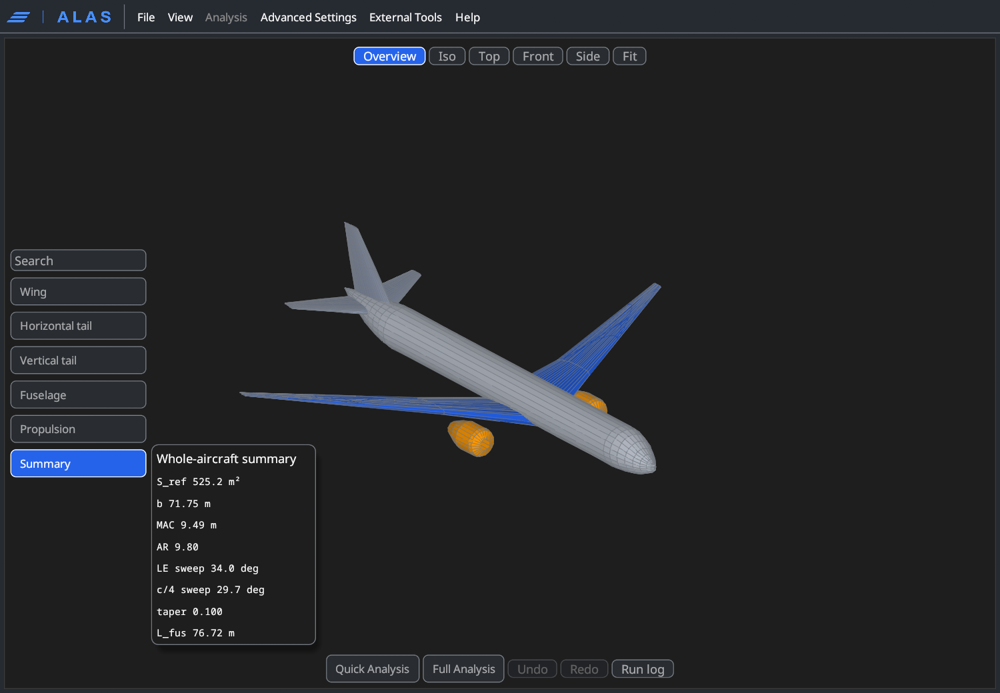
  <figcaption>The Summary card for the AVE reference: S_ref 525.2 m², b 71.75 m, MAC 9.49 m, AR 9.80, leading-edge sweep 34.0°, c/4 sweep 29.7°, taper 0.100, fuselage 76.72 m.</figcaption>
</figure>

## Editing geometry

### Drag handles

The viewport draws a handle on the geometry for each editable parameter; the one nearest the pointer highlights. A handle is a point on
the geometry attached to one parameter and one direction: dragging projects
your pointer motion onto that direction and writes the parameter. A drag is
exactly one field edit, with the same validation and the same undo step as a
typed value, and the hover label says which parameter it changes.

| Component | Handles |
|---|---|
| Wing | Span (tip), root chord, break chord, tip chord, leading-edge sweep (break), tip twist, wing longitudinal position |
| Wing sections | Span station, leading-edge x, chord, height and twist of each section you created |
| Horizontal tail | Tail position, tail scale, tail tip sweep |
| Vertical tail | Fin height, fin tip sweep |
| Fuselage | Length, nose height, diameter, the generated and custom section stations, widths, heights and vertical positions, the upper-deck hump height and its four stations |
| Propulsion | Engine spanwise position, engine height, inlet offset |

Airfoil shapes are never deformed by dragging. The assigned profile changes
only through the airfoil pickers in the discipline editors.

### Discipline editors

Each button in the left stack opens a window with the full field list for that
component, grouped:

| Discipline | Groups |
|---|---|
| Wing | Planform, Twist and dihedral, Placement, Airfoils, Mesh; plus a **Create wing sections** card |
| Horizontal tail, Vertical tail | Planform, placement and section parameters of each surface |
| Fuselage | Body, Stations, Profile, Upper deck; a **Section editor** and a **Create fuselage sections** card |
| Propulsion | Installation and nacelle fields, with a button to add or remove a mirrored engine pair |

Typed edits apply on commit and update the preview. Every field shows its
valid range, rejects values outside it with a message, and offers a reset to
the AVE reference value. A group has **Reset group to AVE**, which also
restores the values that depend on it. **Focus** in the window title row
isolates that component in the viewport.

<figure markdown>
  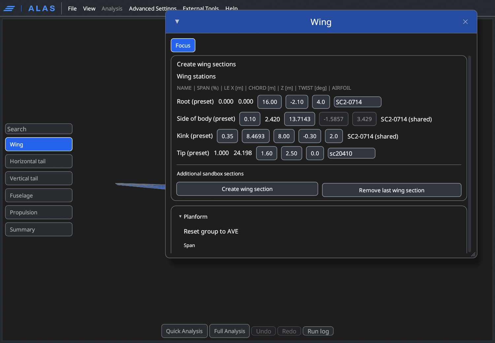
  <figcaption>The Wing window: the stations table (root, side of body, kink, tip) with buttons to create or remove extra sections, above the grouped fields.</figcaption>
</figure>

<figure markdown>
  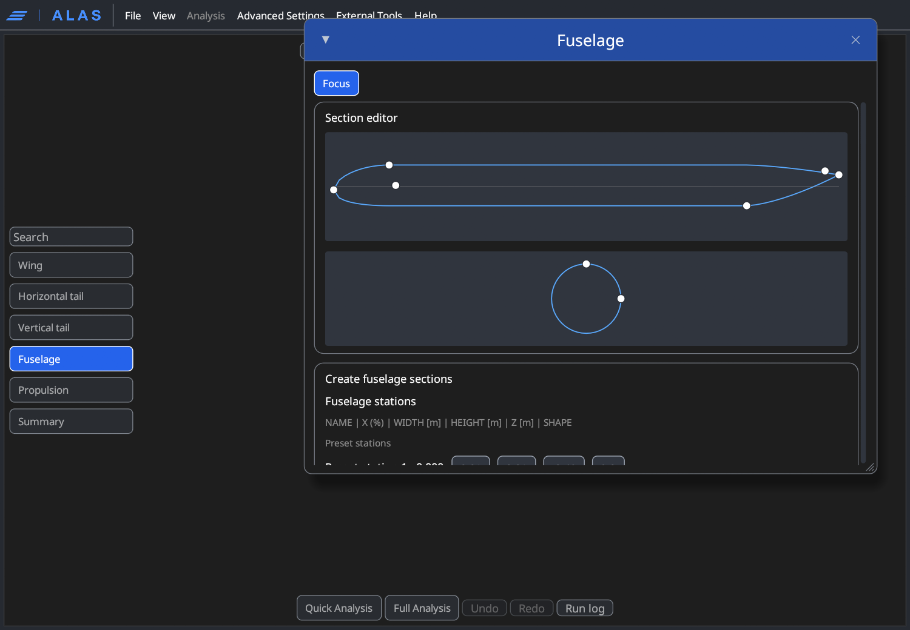
  <figcaption>The Fuselage window: draggable side profile and cross-section above the grouped fields.</figcaption>
</figure>

Notes on specific editors:

- **Wing tip rise in flight.** The wing heights (`root_z_m`, `break_z_m`,
  `tip_z_m`) are the static ground shape that ground clearance uses. The
  optional *flight tip rise* (as a fraction of the semispan, between 0 and
  the validity ceiling shown in the field) is how far the tip rises from that
  ground shape to the 1 g flight shape. The aerodynamics and the dihedral
  checks use the flight shape. Unset means one shape serves both.
- **Wing stations and Create wing sections.** The stations table lists the
  root, side-of-body, kink and tip stations (span fraction, leading-edge x,
  chord, height, twist and airfoil), with the preset values editable in place.
  **Create wing section** inserts an extra spanwise section with its own
  station, leading-edge position, chord, height and twist and an airfoil from
  the library (searchable by name); **Remove last wing section** deletes it.
- **Fuselage section editor.** A side profile with draggable nose height,
  cabin start, cabin height, tailcone start, fuselage length and tail height,
  and a cross-section with draggable width and height. The profile follows the
  builder's station laws: the nose radius grows as
  $\sqrt{1-(1-\xi)^2}$ and the tailcone radius shrinks as $1-\xi^{3/2}$.
- **Nose geometry.** Six optional fields (windshield angle, crown-end
  fraction, radome length fraction, keel exponent, plan exponent and section
  exponent) replace the single-ellipsoid nose with a shaped nose (upper, lower
  and plan profiles). All unset keeps the ellipsoid. The ranges are the valid
  ranges of the nose model.
- **Upper deck.** Hump height, four stations (start, crown start, crown end,
  end) and a fairing exponent add a 747-style upper-deck hump over a
  constant-crown fuselage; all unset gives a constant crown. The stations must
  be ordered, and an inconsistent set is ignored. Three further fields (upper
  floor height, start and end) make the hump a passenger deck in the cabin
  layout. This editor is in the v1.3.2 source tree; the
  published v1.3.1 package does not have it.
- **Belly upsweep.** The optional upsweep length places the start of a rising
  straight lower line ahead of the tailcone. It sets the tail-down angle that
  the [tip-back and tail-scrape checks](reference/formulas.md#tail-down-tip-back-and-main-gear-placement) use.

If a combination of values does not build, the viewport keeps the last valid
shape and says so; nothing is silently substituted.

### Advanced Settings

The **Advanced Settings** window (menu bar, or View) shows the same pages as
the guided workspace: Geometry, Control Surfaces, Mass, Structures,
Propulsion, Landing Gear, Performance, Analysis fidelity, Mission Analysis,
Optimizer, MSES Analysis, External Tools and Run options. Anything that is not
a drawn-geometry parameter (mass-model assumptions, gear, performance
constants, the route) is edited there. Unlike the guided workspace, the
Geometry and Control Surfaces tabs are not locked in the sandbox.

<figure markdown>
  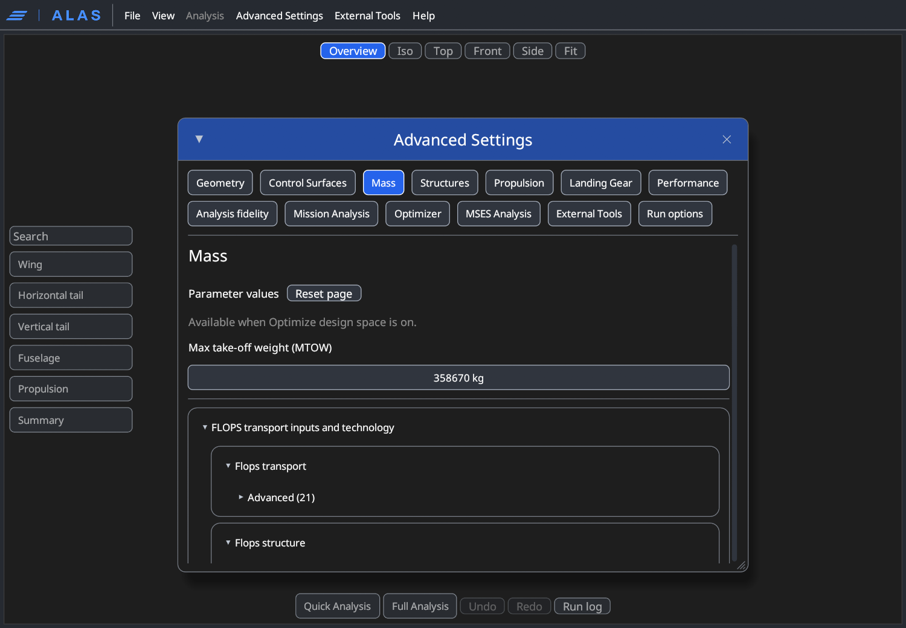
  <figcaption>Advanced Settings inside the sandbox, on the Mass tab: the same tabs as the guided workspace, with geometry unlocked.</figcaption>
</figure>

## Undo, redo and persistence

Every committed edit (a typed value, a drag, a reset) records the state before
it. **Undo** and **Redo** are buttons in the action row and the shortcuts
Ctrl+Z, Ctrl+Y and Ctrl+Shift+Z. A drag is one transaction: only the state
before the pointer went down is stored, so one undo returns to the pre-drag
geometry. The history holds the last 200 steps, lives only for the current
session, and is never saved.

<figure markdown>
  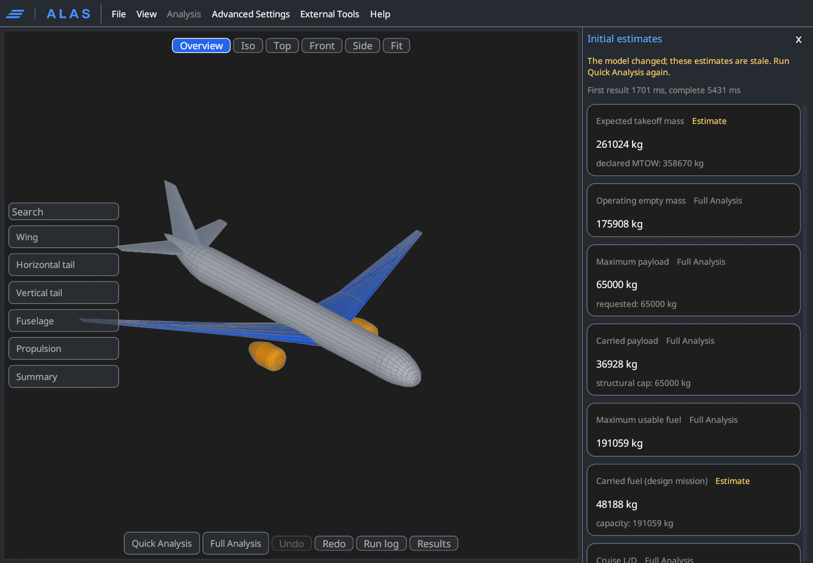
  <figcaption>After Undo the geometry returns to its previous state in one step; Redo becomes available.</figcaption>
</figure>

**File, Save configuration** writes the aircraft as an ordinary ALAS
configuration plus an `alas_workspace` entry carrying what the configuration
alone cannot: the workspace mode, the active design vector, the last sandbox
or promoted design (so a later entry can resume it) and the window layout. The
file stays a valid configuration for every other consumer, and a file without
that entry loads exactly as it always did.

## Quick Analysis and the estimates strip

**Quick Analysis** runs in-process, on a background thread, for the drawn
aircraft at fixed geometry. First results usually arrive within seconds and
the rest fill in as they complete; the strip header shows the time to the
first result and to completion. The strip opens on the right when you run it
(and is toggled from View, Estimates strip).

<figure markdown>
  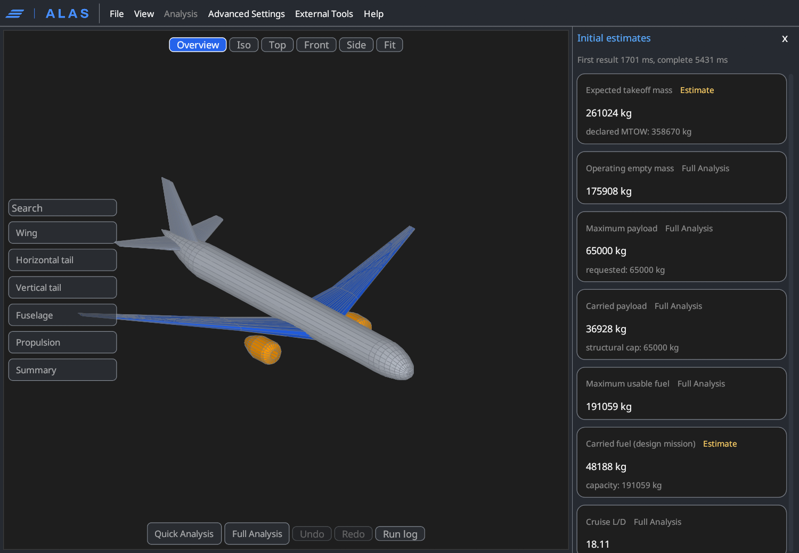
  <figcaption>Initial estimates for the AVE reference, each card tagged as the Full Analysis value or as an estimate: expected takeoff mass 261,024 kg against the declared MTOW of 358,670 kg, operating empty mass 175,908 kg, maximum payload 65,000 kg, carried payload 36,928 kg.</figcaption>
</figure>

### What it reports

| Card | Basis | Notes |
|---|---|---|
| Expected takeoff mass | Estimate (closure) | The mass this exact geometry must lift to fly the brief, next to the declared MTOW |
| Operating empty mass | Full Analysis | |
| Maximum payload, Carried payload | Full Analysis | Structural capacity (declared cap bounded by MZFW and by MTOW minus OEW) and the declared load case |
| Maximum usable fuel | Full Analysis | Usable tank capacity the Full Analysis applies |
| Carried fuel (design mission) | Estimate (closure) | Mission fuel against tank capacity |
| Cruise L/D, Static margin | Full Analysis | Trimmed cruise L/D and fine-lattice static margin |
| Cruise speed, Cruise altitude, Service ceiling | Estimate (envelope) | Maximum-climb thrust against the trimmed drag table; the ceiling is where the rate of climb falls to 0.508 m/s (100 ft/min), within the engine deck domain |
| Range | Estimate (closure) | Still-air range of the carried fuel against the requested route |
| Block fuel: Design mission (great circle) | Estimate (closure) | |
| Block fuel: Route | Full Analysis | The planned route, flown off-design; the title states its source (airway, KML or SimBrief dispatch plan, or great circle) and its excess over the great circle |
| Payload-range | Full Analysis | Corner points: maximum payload with fuel to MTOW, maximum fuel with payload traded, ferry |
| Feasibility | Full Analysis | Physical feasibility findings plus the closure's dispatch flags; blocking and non-blocking flags are coloured differently |

Altitudes are shown in metres with the flight level beside them, ranges in
kilometres and nautical miles, speeds in m/s and km/h. Hover a value for the
assumption or limit that qualifies it.

### How the estimates are bounded against the Full Analysis

Every card carries one of three tags, with the explanation in its hover text:

- **Full Analysis.** The value the Full Analysis computes for this aircraft,
  by the same function on the same inputs. On the registered presets the two
  agree to the bit.
- **Estimate (closure).** A mission-sized mass closure of the fixed aircraft.
  The Full Analysis prices the route on this closure's drag table, trimmed at
  its converged takeoff mass and centre of gravity, and on its frozen plan, so
  over the same still-air distance its dispatch lands on the same fixed point:
  within the dispatch settling tolerance (1 kg by default) in takeoff mass,
  takeoff fuel and block fuel. The measured difference on the registered
  presets is at most 0.5 kg. A route flown along airways is longer and needs
  more fuel, which is why the route block fuel is a separate card.
- **Estimate (envelope).** A thrust-limited value that the Full Analysis does
  not report, computed at one representative mass (the closure takeoff mass)
  for the whole cruise. It has no bound against the Full Analysis because
  there is nothing to compare it with.

If you edit anything after a Quick Analysis, the cards are marked stale
immediately, the running job is asked to stop at its next boundary, and any
late result for the older geometry is discarded rather than shown against the
new one.

<figure markdown>
  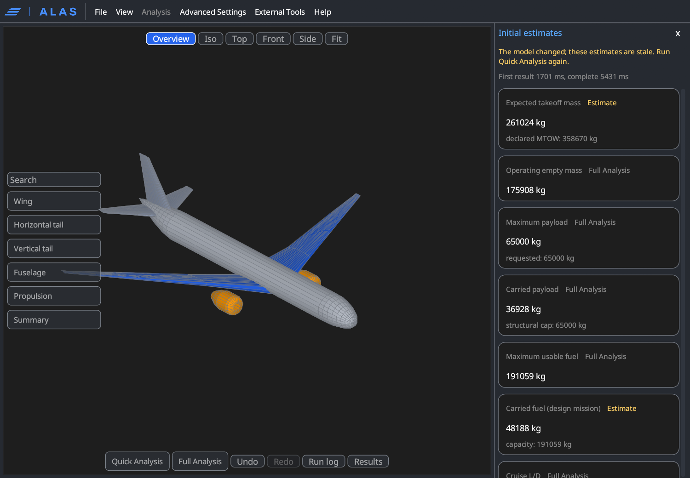
  <figcaption>After an edit the cards are marked stale; Undo and Redo reflect the history.</figcaption>
</figure>

!!! warning "Bounded, not validated"
    The bounds above are agreement between two ALAS computations of the same
    aircraft. They say nothing about how close either is to a real aircraft.

## Full Analysis

**Full Analysis** runs the complete pipeline on the drawn aircraft as a fixed
design: the full baseline analysis (aerodynamics, mass and balance, structures,
propulsion, mission, field performance) with no optimization and no redesign,
at the declared design weights. Progress streams into the run log; **Cancel**
stops at the next safe stage boundary. The results open in their own window
(**Results** in the action row reopens it) with the same tabs as the guided
Results page. See [Running ALAS](running-alas.md) and
[Optimization results](optimization-results.md) for how to read them.

<figure markdown>
  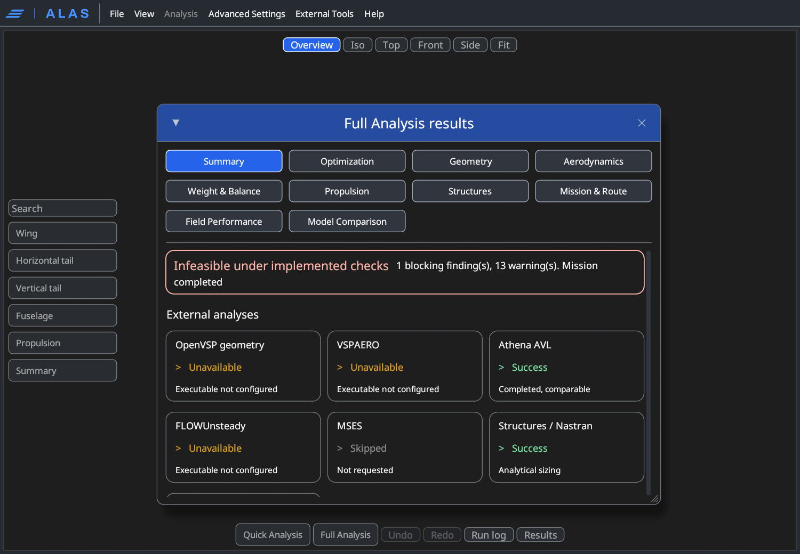
  <figcaption>The Full Analysis results window: the same tabs as the guided Results page.</figcaption>
</figure>

!!! warning "Why the sandbox Full Analysis can differ from the guided run"
    The screenshot above is the Full Analysis of the unmodified AVE reference
    inside the sandbox, and its summary reads "Infeasible under implemented
    checks" with **1 blocking finding** (and 13 warnings). A guided,
    optimized run of the AVE preset with no finite-element solvers had no blocking
    findings (13 warnings). They are different
    configurations: in the sandbox every design variable is pinned, so the
    aircraft is analysed exactly as drawn, whereas the guided run is
    optimized, and the optimizer moves the design until the hard constraints
    pass. A blocking finding in the sandbox therefore means "this exact
    geometry fails a hard check", which is information about the drawing, not
    a failure of the analysis. Open the finding in the summary to see which
    check it is.

## Leaving the sandbox: promote or discard

**File, Leave sandbox** asks what to do with the aircraft:

- **Promote to guided workspace.** The drawn aircraft becomes the guided
  workspace's custom baseline. The preset identity stays cleared, the design
  mode becomes clean-sheet, and the fuselage is no longer sized from the cabin
  (the geometry is the baseline as drawn; sizing the fuselage from the cabin
  would silently redraw it). The Inputs page shows *Custom baseline active*.
  The run options switch to optimizing, so **Run** now searches the
  [design space](design-space-and-optimizer.md) around your aircraft, while
  **Analyze reference** analyses it as drawn. Results that do not match the
  promoted aircraft are dropped: the previous case's results always, and the
  sandbox's own if you edited after its Full Analysis.
- **Discard sandbox.** Restores the previous guided case and its results
  untouched.
- **Cancel.** Stays in the sandbox.

<figure markdown>
  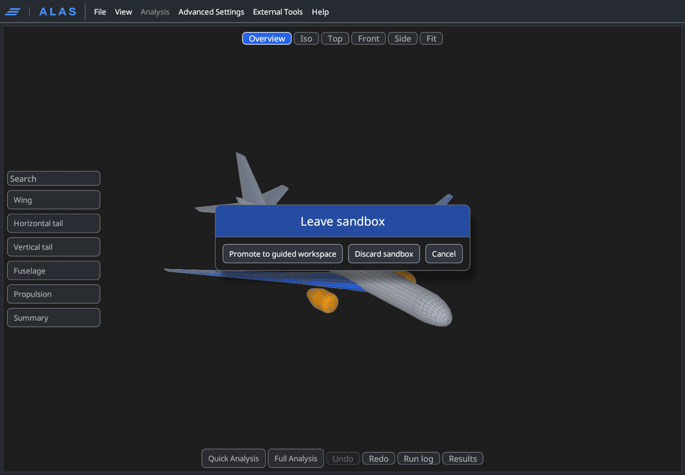
  <figcaption>File, Leave sandbox: promote the aircraft, discard it, or cancel.</figcaption>
</figure>

<figure markdown>
  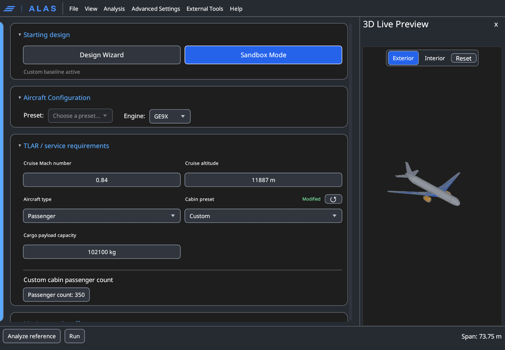
  <figcaption>After promotion the Inputs page shows Custom baseline active; the preset selector is empty and Run optimizes around your aircraft. The "Span: 73.75 m" in the status bar of this capture is the note of the last edit (a 2 m span increase that was undone before leaving), not the aircraft's span.</figcaption>
</figure>

Leaving is refused while a sandbox Full Analysis is still running; cancel it
first. Promotion also requires a valid configuration, and the prompt stays
open with the offending fields highlighted if there is a problem.

From the guided workspace, the promoted design is edited like any
[clean-sheet design](design-space-and-optimizer.md#clean-sheet-design) and
can be re-entered in the sandbox at any time: Sandbox Mode resumes it,
carrying its latest guided edits.

## Limitations

- The sandbox analyses a drawn aircraft; it does not size one. Nothing is
  optimized inside it, and choosing a different engine does not resize the
  airframe for you.
- Airfoil shapes come from the library; they are not deformed by dragging.
- The estimates are conceptual-design models. The closure and envelope tags
  state their bounds against the Full Analysis, and none of it is validated
  against measured aircraft performance.
- Standalone analyses (wing analysis, airfoil CFD, airfoil screening) are not
  available while the sandbox is open.
- Undo history is per session and is not saved.
- Geometry that does not build is rejected with a message and the last valid
  shape stays on screen; the edit is not applied.
