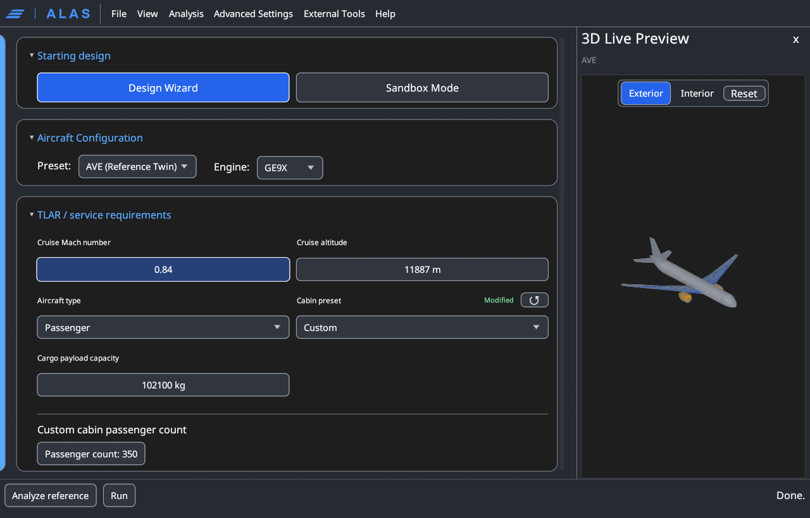
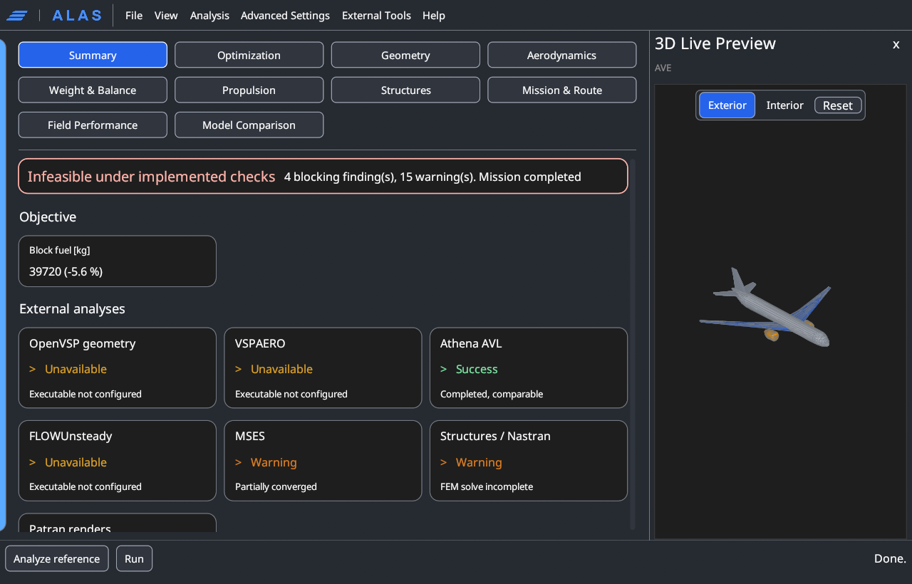

# User guide

This is the tour of the application: the window, every page in the navigation,
the Advanced Settings window, the standalone analyses, and the actions
available to you. It is organised the way the interface is, so you can read
it front to back or jump to whichever page you are looking at.

If you have not installed ALAS yet, start with
[Installation](installation.md). To draw an aircraft that is not in the preset
list, read [Sandbox mode](sandbox.md). If you want to understand *why* the
application is arranged this way, [How ALAS works inside](architecture.md)
explains the machinery underneath.

## The window

The application has two workspaces. This guide describes the **guided
workspace**, the one ALAS opens in. The **sandbox** is a separate full-window
workspace for free-form geometry editing and has its own
[chapter](sandbox.md).

The guided workspace is one window with these parts:

| Region | What it is |
|---|---|
| **Menu bar** | File, View, Analysis, Advanced Settings, External Tools and Help |
| **Navigation sidebar** | Three groups (Setup, Modeling, Results) containing the pages below |
| **Main panel** | Whichever page is selected |
| **Live preview** | A dock beside the form (View, 3D Live Preview) that redraws as you edit: the three-view geometry, cabin layout, load and trim sheet, engine cycle, and so on, depending on the page |
| **Control bar** | **Analyze reference**, **Run** (**Cancel** while running), the elapsed time and the current stage |
| **Run log** | The streamed log of the run (View, Show Run Log) |

!!! tip "Field labels are the real reference"
    Hover (or focus) almost any field's label in the application for its own
    explanation, written against the code that consumes it, with its unit and
    valid range. Page titles show a longer description on hover. This guide is
    the map; those labels are the territory.

---

## Menus

**File**

- *Load configuration* and *Save configuration* (with an editable path).
  Configurations are YAML or JSON, so a setup is reproducible, diffable and
  shareable. Saving writes everything currently set, plus a small
  `alas_workspace` entry that remembers the workspace mode and the last custom
  design; loading applies a file over the defaults.
- *Export figures (ZIP)* and *Generate report (PDF)*, enabled once a run has
  completed.
- *Manage storage...* shows an inventory of the locations ALAS stores data in,
  lets you clear them (not while a run is active), and resets the saved tool
  paths without removing any installed tool.
- *Load preset* lists the twelve aircraft presets.
- *Clean sheet design (sandbox)* opens [Sandbox mode](sandbox.md).

**View**: show or hide the run log; the *Dark*, *Light* and *Grey* themes;
*3D Live Preview*; *Reduced Animations*; *English* or *Spanish* interface
language; and *Automatic zoom*, *Zoom in*, *Zoom out* and *Reset zoom*. Figures
follow the theme, so charts stay legible in whichever you pick and exported
images match what you saw.

**Analysis** opens three standalone windows that do not need a whole-aircraft
run (see [Standalone analyses](#standalone-analyses)).

**Advanced Settings** opens the detached settings window (see below).

**External Tools** opens the tool manager: where each external program lives,
its official acquisition page, whether it was found, and the optional data
downloads ALAS can fetch for you. See the
[External tools guide](external-tools.md).

**Help**: *Replay Walkthrough* restarts the guided introduction, *Advanced
Walkthrough...* opens the deeper one, *External Tools Overview...*,
*Documentation* (this site) and *About ALAS*, which shows the licence, the
source link and the third-party notices (see [Licensing](licensing.md)).

---

## Setup

The pages you need before a first run.

### Inputs

The mission you want flown and the aircraft that will fly it. The page is a
column of cards:

<figure markdown>
  
  <figcaption>The Inputs page with the AVE (Reference Twin) preset, GE9X engine, Mach 0.84, 11,887 m and 350 passengers, with the 3D live preview and the Design Wizard / Sandbox Mode switch.</figcaption>
</figure>

- **Starting design.** Two choices. **Design Wizard** analyses or adapts a
  registered aircraft; its defining geometry stays protected from manual edits
  (see [Sandbox mode](sandbox.md#why-a-separate-mode)). **Sandbox Mode** opens
  the free-form editor, the first time from AVE and afterwards resuming your
  last sandbox or custom design. *Custom baseline active* appears when a design
  promoted from the sandbox is the current one.
- **Aircraft Configuration.** The **Preset** (twelve ship with ALAS: **AVE**,
  the long-range reference twin, **A340-300**, **A380-800**, **B787-9**,
  **A320-200**, **A220-300**, **ATR72-600**, **DC-10**, **E195-E2**, **C919**,
  **B747-400** and the **A400M** freighter) and the **Engine** from the
  catalogue. Choosing a preset swaps the geometry, engine, cabin, landing gear,
  fuel tanks and design-space bounds together, as a consistent set.
  Selecting a different engine re-scales nacelle geometry, mounting and the
  wetted-area drag contribution automatically.
- **TLAR / service requirements.** Cruise Mach and altitude (the design point
  everything is sized around), the aircraft type (`passenger` or `cargo`), the
  cabin preset and passenger count, and the other top-level requirements. The
  passenger count follows the cabin preset and is editable when the cabin
  preset is `Custom`. Fields marked *advanced*
  (structural load factors, sizing constraints, the stability target, the CG
  envelope width) are on this page too. [Mission requirements](mission-requirements.md)
  explains what each one constrains.
- **Maximum take-off mass.** The takeoff-mass mode and value (see
  [Takeoff-mass modes](design-space-and-optimizer.md#takeoff-mass-modes)): a hard
  requirement, a mass sized by the mission, or a band around a target, with its
  allowed variation.
- **Route.** The **Departure airport** and **Arrival airport**, which fix the
  range and the fields that [mission](mission-and-route.md) and
  [field-performance](field-performance.md) analysis use.
- **Run options.** *Optimize design space* (on: the optimizer searches the
  design space before analysis; off: the current design is analysed as drawn),
  *Compare against baseline design*, *Write CPACS aircraft and output files*
  and the output directory.

### Design Space

The sixteen geometric degrees of freedom the optimizer is allowed to move,
one editor per variable. Each shows:

- an **initial value**: the starting design, and the one analysed when you
  skip optimization;
- a **lower and upper bound**: the box the search may explore.

At the top a card shows the **design mode** and its options. *Analyze
reference* (a registered aircraft at its published values, no search),
*Adapt reference* (a bounded envelope around the preset, with its half-width
controls) and *New aircraft* (a clean-sheet design whose start and bounds are
derived from the brief, with the option to size the fuselage from the cabin).
A **Design constraints** card lists the limits a candidate must satisfy.
Widening a bound gives the optimizer more freedom and a larger space to get
lost in; narrowing one is how you say "I have already decided this".
[Design space & optimizer](design-space-and-optimizer.md) lists all sixteen
with their defaults.

### Analyses

One page of switches deciding which stages run. **Core (every run)** shows
what always runs: aerodynamics (VLM and drag build-up), weight and balance and
stability, the propulsion cycle, and field performance. **Optional (toggle per
run)** has native mission analysis, 2-D airfoil analysis (MSES) and the
wing-box structures stage. **External downstream tools** has the OpenVSP
export, VSPAERO, AVL and FLOWUnsteady, and the structural solver cases (the
Nastran solve, the NASTRAN-95 comparison and the Patran deformation export).
Turning a stage off makes runs faster; turning one on costs time but fills in
a results tab. Nothing here changes the aircraft, only how much is computed
about it.

### Fixed-Wing UAV

A guided workflow for small electric fixed-wing aircraft: a component catalogue
with sourced hardware, sizing of the mission and airframe assumptions, a
layout, and verification on the same physics core as the transport pipeline.
Evidence boundaries and the status of the selected design convention stay
visible before a run. UAV sizing is separate from the transport-aircraft
pipeline described in the rest of this guide.

---

## Modeling

The routine inputs of each discipline. All have sensible defaults; you can run
without touching any of them.

| Page | What it holds |
|---|---|
| **Cabin & Cargo** | The passenger class mix (first, business, premium, economy, each with its own seat count, pitch, width and mass) or, for a freighter, the cargo-deck configuration, container types and loading strategy. See [Cabin & payload](cabin-and-payload.md). Selecting the page shows the interior in the live preview |
| **Mass** | The mass method and CG-solver assumptions: the FLOPS transport weight equations that are the product default, declared inputs and technology factors. Preview: the load and trim sheet |
| **Aerodynamics** | The drag model (parasite build-up plus Korn wave drag), the technology factor for the airfoil, and the airfoil sections assigned to the wing and tail. Induced drag is not set here; it comes from the vortex-lattice solution. Preview: drag against Mach |
| **Structures** | Wing-box layout, materials and gauges, plus the gear load limits used by the gear-load checks. The analytical solver always runs. Preview: wing-box planform. See [Structural analysis](structural-analysis.md) |
| **Propulsion** | The on-design turbofan cycle assumptions (component efficiencies and pressure ratios) of the selected engine. Preview: the cycle. See [Propulsion analysis](propulsion-analysis.md) |

---

## Advanced Settings

Advanced controls live in a detached window (menu bar, **Advanced Settings**)
so they never take space from the page you are working on. It has one tab per
group of settings; the Mass, Structures and Propulsion tabs show the advanced
fields of the same groups as the Modeling pages, so one configuration is
edited from either place.

| Tab | What it holds |
|---|---|
| **Geometry** | The fixed geometric scaffold the design vector morphs against: fuselage, empennage and nacelle placement, plus the optional nose, upper-deck and belly-upsweep fields. For a registered preset this tab is locked (see [Sandbox mode](sandbox.md#why-a-separate-mode)) |
| **Control Surfaces** | Chord and span fractions for slats, flaps, ailerons, spoilers, elevator and rudder. Locked for a registered preset. These are representational: they drive the sizing diagram only and are not fed into the aerodynamic or mass models |
| **Mass** | NASA FLOPS transport inputs, structural technology factors, high-lift mass loads and the legacy fraction controls |
| **Structures** | Rib and mesh discretisation, solver limits and the random-excitation force spectrum |
| **Propulsion** | The engine's rating and cycle anchors, its installation and nacelle placement, and the propulsion mass factors |
| **Landing Gear** | Main- and nose-gear placement, strut and tyre sizing, tip-over and strength assumptions, and the tip-back and rotation settings behind the [CG envelope](weight-balance-and-stability.md#rotation-the-forward-cg-limit) |
| **Performance** | High-lift and field-performance constants (maximum lift coefficients, thrust lapse, engine-out climb gradient, landing constant) and the take-off and approach speed schedules. A **performance preset** picker fills them with a coherent set |
| **Analysis fidelity** | The angle-of-attack sweep range and point count and the vortex-lattice panel densities for the coarse (in-loop) and fine (final) passes. A **fidelity preset** picker offers matched sets |
| **Mission Analysis** | The flown mission: whether it runs, route and asset directories, the timeout, and the complete speed profile (climb rates, cruise-leg speeds, descent steps). See [Mission & route analysis](mission-and-route.md) |
| **Optimizer** | Search settings: strategy, budget, tolerance, seed and workers, the objective and the takeoff-mass mode (see [Design space & optimizer](design-space-and-optimizer.md#the-objective-function)). A **solver preset** picker fills them with a coherent set |
| **MSES Analysis** | The optional transonic section solve: the sweep it runs over and its convergence limits. If MSES reports the target lift coefficient outside its converged range, widen the sweep half-width. See [Transonic section analysis](transonic-analysis.md) |
| **External Tools** | The tool locations and statuses (the same page as the External Tools menu) |
| **Run options** | The aerodynamic solver selection: ALAS VLM, Athena AVL, or both, for the evaluation backend and for the reported results |

Two optimizer settings deserve attention. **Seeding near the initial design**
starts the population close to a known-valid aircraft instead of scattering it
across the whole box, which is usually what you want. **Seed** fixes the random
sequence: set it if you want two runs to be comparable.

Routing is attempted in order of fidelity: an imported SimBrief or KML flight
plan, then the airway graph if the navigation data has been downloaded, then a
great-circle track. Each falls through to the next, so a route always renders.

---

## Standalone analyses

The **Analysis** menu opens tools that work on the current configuration
without a whole-aircraft run. They are not available while the sandbox is
open.

- **Open Wing Analysis**: analyses the wing of the current configuration,
  optionally with the empennage as lofted, without a mission or a payload. The
  header states what is modelled and the Setup tab lists what is omitted.
- **Open Airfoil CFD**: OpenFOAM airfoil studies with the geometry resolved
  from the section database. It needs OpenFOAM configured under External Tools.
- **Open Airfoil Screening**: searches the section catalogue against your
  current design and returns a ranked shortlist, as described in
  [Airfoil screening](airfoil-screening.md). Controls: the scoring weights
  (lift-to-drag, fuel volume, robustness), thickness bounds, a name filter, a
  static-margin floor, how many candidates proceed to the three-dimensional
  pass, and how many finalists get an MSES check. A screening run reports
  progress and **can be cancelled**.

---

## Running

The control bar has two actions.

- **Analyze reference** analyses the selected aircraft and load case with no
  redesign. It skips the optimizer entirely and is fast. Use it constantly:
  it is the right way to check that a preset or a hand-edited design space is
  sane before committing to a full search.
- **Run** does what the *Optimize design space* option on Inputs says:
  optimize, analyse and fly the mission in one pass, or analyse the current
  design as drawn. It is disabled, with a marker beside it, when the
  configuration has a validation error; hover the marker for the reasons.

Progress streams into the run log as each stage completes, and **Cancel**
stops at the next safe stage boundary (active external tools finish first).
If the log reports a stage as unavailable (MSES not installed, Nastran without
a licence), the run has not failed. Optional stages degrade individually and
everything else completes.

---

## Results

Results are grouped by discipline. Which tabs have content depends on what ran.

| Tab | Contents |
|---|---|
| **Summary** | The design point as text, the objective tile and the key numbers |
| **Optimization** | Evaluation history, design evolution, planform and polar comparison against the baseline, airfoil evolution |
| **Geometry** | Three-view, wireframes of the wing, fuselage and empennage |
| **Aerodynamics** | Lift, drag and moment sweep, drag breakdown, span loading, VLM streamlines, airfoil comparison and spanwise evolution, section behaviour against Reynolds number, control surfaces, V-n envelope, dynamic modes, VSPAERO figures when enabled, and the MSES pressure, Mach and Cp figures |
| **Weight & Balance** | Mass breakdown, mass distribution, the load and trim sheet (CG envelope), static margin and side view, fuel-volume check, landing-gear planform, cabin and payload layout |
| **Propulsion** | Cycle summary, carpet plot, efficiency decomposition, bypass-ratio sensitivity, altitude and Mach sweep |
| **Structures** | Wing-box sizing, static loads, stress margins, normal modes, vibration, Patran renders |
| **Mission & Route** | Ground track, mission profile, airspeeds, flight path, aerodynamic coefficients and forces, drag components, payload-range |
| **Field Performance** | The matching chart and take-off and landing at the departure and arrival airports |
| **Model Comparison** | The aerodynamic models on shared axes |

<figure markdown>
  
  <figcaption>The Summary tab after a short-budget AVE optimization (240 + 160 evaluations): block fuel 39,720 kg (-5.6 %), infeasible under the implemented checks (4 blocking findings from the finite-element root-stress checks, 15 warnings), and the external-analysis status cards (AVL success, MSES partially converged, MSC Nastran with a warning, OpenVSP, VSPAERO and FLOWUnsteady unavailable).</figcaption>
</figure>

A tab that could not be produced says **Not available for this run** and
explains why, rather than disappearing.

### Getting results out

Two exports from the File menu once a run has completed, plus the files a run
writes:

- **Generate report (PDF)**: a bound document of the whole run.
- **Export figures (ZIP)**: every chart as SVG sources.
- **The output folder**: the design database JSON, the winning section
  coordinates, the CPACS aircraft and the cabin layout files.

[Reporting & export](reporting-and-export.md) describes each format and what
is in it.

---

## A suggested first session

1. Open **Inputs**, choose a preset close to what you have in mind, and set
   your cruise point, weight and payload.
2. Press **Analyze reference**. Read the Weight & Balance tab. Does the CG
   envelope look sane? Is the static margin plausible? If not, the problem is
   in your inputs, and no amount of optimizing will fix it.
3. Open **Design Space** and narrow anything you have already decided.
4. Press **Run**. Watch the log.
5. Read **Optimization** first. Did the search actually improve anything, or
   did it converge immediately? Then work through the discipline tabs.
6. **Save configuration** so you can get back here, and **Generate report
   (PDF)** so you have the run written down.

The mistake worth avoiding is going straight to a full run with unexamined
inputs. The baseline pass exists precisely so you can catch a bad assumption
in twenty seconds instead of twenty minutes.

If you want to change the aircraft itself (move the wing, reshape the nose,
add an engine) rather than resize it, do that in [Sandbox mode](sandbox.md) and
promote the result.
