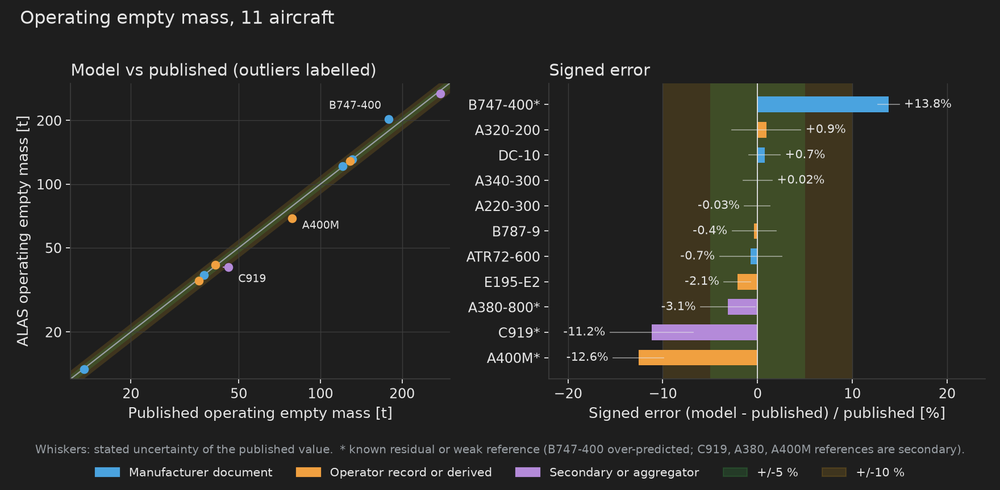
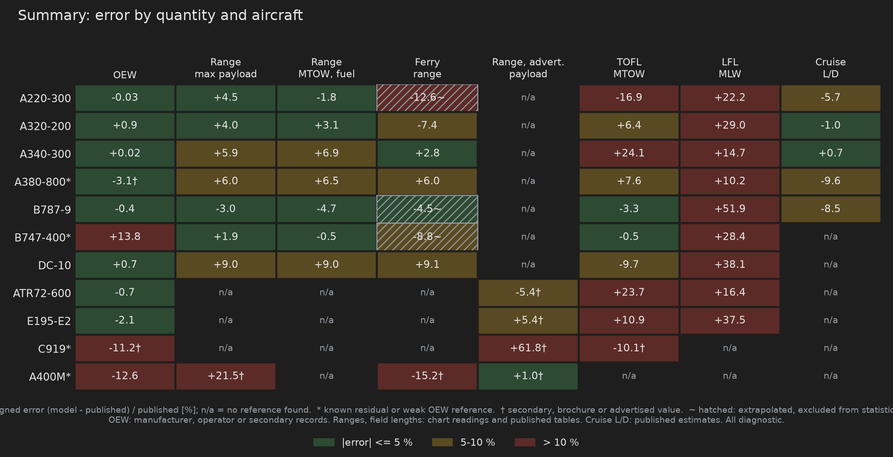
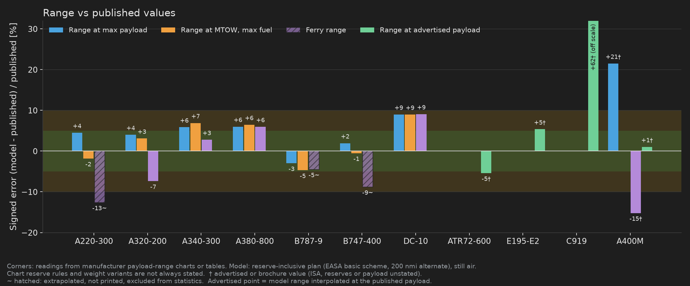
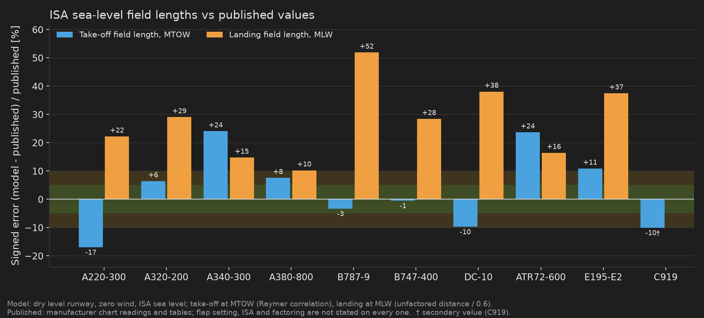
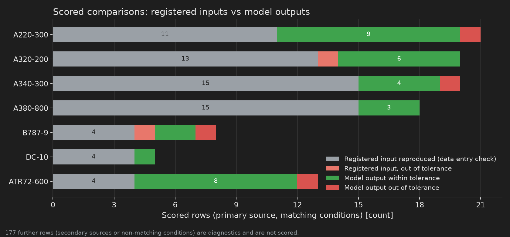

# Validation against published data

This page compares the current ALAS model, run on every registered aircraft
preset, with published reference values. It states how large the errors are,
which comparisons are independent checks and which only confirm that a
reference value was entered correctly, and where the model is known to be
wrong.

**Error convention.** Every error on this page is
`(model - published) / published`, in percent. A positive error means the model
is above the published value.

**What this page is not.** It is not a certification claim, and none of the
references is a weighed-aircraft or flight-test dataset. Most references are
airport-planning documents, type-certificate data sheets, operator
specifications, and readings taken from published payload-range charts.

## Method

- **Model runs.** Each of the 12 registered presets (A220-300, A320-200,
  A340-300, A380-800, B787-9, B747-400, DC-10 (-30), ATR 72-600, E195-E2, C919,
  A400M and the notional AVE) is run through the native pipeline at its
  registered design vector. There is no optimisation and no per-aircraft
  multiplier applied to force agreement with a published total. Version: ALAS
  1.3.2 development tree, 2026-10-06. AVE is a notional aircraft with no
  published data and is excluded from every error statistic.
- **Reference sources, by quality.**
    - *Manufacturer document:* airport-planning (ACAP) documents, the A220
      recovery publication, the ATR factsheet. A220-300, A340-300, B747-400,
      DC-10 and ATR 72-600 operating empty masses are in this class.
    - *Operator record or derived value:* an operator specification sheet
      (A320-200), a value derived from certified maximum zero-fuel mass minus a
      published maximum payload (E195-E2), a superseded manufacturer page whose
      attribution has not been re-verified (B787-9), an operator web page
      (A400M).
    - *Secondary or aggregator:* a compiled value with no primary document
      (A380-800, C919).
    - *Chart readings and tables:* payload-range, field-length and cruise
      lift-to-drag values read from manufacturer charts, brochure tables or
      published estimates, plus compiled database and encyclopedia values
      (marked with a dagger). These are secondary.
- **Scored versus diagnostic.** An aircraft-parity harness
  (`tools/aircraft_parity.cjs`, contract `golden/aircraft/real_aircraft_parity.json`)
  scores a comparison only when the source is primary and the conditions
  (variant, mass, reserve rules) match. Everything else is a diagnostic:
  reported, not scored.
- **Calibration versus check.** Registered inputs (maximum take-off, landing
  and zero-fuel mass, usable fuel, span, fuselage length, planform area,
  gear stations, declared engine dry mass) are copied from the references. A
  match there confirms data entry. It is **not** a prediction and is not
  presented as validation here. The planform is built from the same published
  geometry, so wing area and mean aerodynamic chord are close to calibration
  too. The operating empty mass, payload-range corners, field lengths and
  cruise L/D are model outputs. The mass model evaluates the NASA FLOPS weight
  equations with declared per-aircraft inputs; the published empty masses were
  visible during development, so the OEW comparison is a verification of that
  model, not a blind prediction.

## Operating empty mass

<figure markdown>
  
  <figcaption>Modelled versus published operating empty mass (OEW) for 11 aircraft. Left: parity plot (log axes, bands at +/-5 % and +/-10 %). Right: signed error, coloured by the quality of the reference; whiskers show the published value's stated uncertainty.</figcaption>
</figure>

**These OEW statistics are diagnostic, conditional comparisons, not validation
records.** In the model's own reference registry, no operating-empty-mass
record is marked as counting toward validation: the A320-200, A380-800 and
B787-9 references are recorded as source gaps, and the C919, E195-E2 and A400M
references are excluded from the validation metrics. The others are recorded as
conditional comparisons (applicability "conditional mismatch"), whose inclusion lists or conditions may differ from the
model's. The numbers below are kept, and read as the size of the gap under
those conditions.

Mean absolute error is 4.1 % over the 11 aircraft, median 0.9 %, and 8 of 11 are
within 5 %. Three aircraft are outside 10 %:

- **B747-400 (+13.8 %).** The reference is a manufacturer specification OEW,
  but its record is a conditional mismatch (the preset now includes the
  smoothed upper-deck hump, whose structure and furnishings the published
  figure may not match). It is a large, known residual and has not been tuned
  away, but it should not be read as a settled over-prediction.
- **A400M (-12.6 %)** and **C919 (-11.2 %).** Both references are weak. The
  A400M value is from an operator page that does not say whether it is
  manufacturer's empty, basic empty or operating empty weight. The C919 value
  is a secondary specification-table figure with no stated inclusion list.
  These errors may be partly or wholly reference definition mismatch; they are
  shown, not hidden.

Read the near-zero errors with care. The A220-300 (-0.03 %) and A340-300
(+0.02 %) agree more tightly than the stated uncertainty of their published
values (about 500 kg and 2,000 kg, or 1.3 % and 1.5 %), so these should not be
read as a 0.03 % model accuracy. A realistic expectation for a manufacturer-document
reference is a few percent.

The model OEW is the sum of the structure, propulsion, systems and furnishings
ledger (including operating items per the FLOPS convention) and excludes
unit load devices, so it matches published empty masses only where the
published inclusion list is similar. Several references do not state one.

## Summary by quantity

<figure markdown>
  
  <figcaption>Signed error for each quantity on the 11 real aircraft. Green: within 5 %. Amber: 5 to 10 %. Red: beyond 10 %. n/a: no reference found. A dagger marks a secondary, compiled, brochure or advertised reference.</figcaption>
</figure>

62 of the 88 cells (11 aircraft, 8 quantities) have a reference. Three of them
are extrapolated ferry values and are excluded from the statistics. Mean and
maximum absolute error by quantity:

| Quantity | Comparisons | Mean abs. error | Max abs. error | Sign |
| --- | ---: | ---: | ---: | --- |
| OEW | 11 | 4.1 % | 13.8 % (B747-400) | 4 of 11 high |
| Range at max payload | 8 | 7.0 % | 21.5 % (A400M) | 7 of 8 high |
| Range at MTOW, max fuel | 7 | 4.6 % | 9.0 % (DC-10) | 4 of 7 high |
| Ferry range | 5 | 8.1 % | 15.2 % (A400M) | 3 of 5 high |
| Range at advertised payload | 4 | 18.4 % | 61.8 % (C919) | 3 of 4 high |
| Take-off field length, MTOW | 10 | 11.3 % | 24.1 % (A340-300) | 5 of 10 high |
| Landing field length, MLW | 9 | 27.6 % | 51.9 % (B787-9) | 9 of 9 high |
| Cruise L/D | 5 | 5.1 % | 9.6 % (A380-800) | 1 of 5 high |

Landing field length is the weakest result, then take-off field length. The
range corners and cruise L/D are within about 10 % except for the A400M and
C919. Cells are empty (n/a) where no published value was found: the
payload-range corners of the ATR 72-600, E195-E2 and C919, the MTOW max-fuel
corner of the A400M, C919 landing length, A400M field lengths, and cruise L/D
of the B747-400, DC-10, ATR 72-600, E195-E2, C919 and A400M. The ferry ranges
of the A220-300, B787-9 and B747-400 are not printed on the charts and appear
only as extrapolations.

## Range

<figure markdown>
  
  <figcaption>Range at maximum payload, at MTOW with maximum fuel, at zero payload (ferry) and at an advertised payload, compared with published chart readings and tables.</figcaption>
</figure>

The model corners are computed with a reserve-inclusive fuel plan in still
air (EASA basic scheme with a 200 nmi alternate, final reserve and
contingency, taxi fuel burned before brake release). Chart reserve rules are
not always stated. The A220-300, B747-400 and B787-9 charts are manufacturer
documents whose weights match the registered preset (the B787-9 chart top line
is 560,000 lb against 561,500 lb, and its max-payload value is adjusted).

For the corner columns the mean absolute error is 5 to 8 %. The largest
errors have a physical cause. At the maximum-payload corner the take-off mass
is the MTOW, so the fuel carried is MTOW minus OEW minus payload. The A400M
OEW is 12.6 % low, so the model carries about 10 t more fuel than the
published case (35.3 t against 25.4 t) and the range is +21.5 %. The ferry
range of the A400M (-15.2 %) is limited by the registered 48.9 t usable
fuel, and the reference does not say whether it uses extra tanks. The B747-400
corners (+1.9 % and -0.5 %) are a clean comparison: the registered MZFW fixes
the fuel at the max-payload corner, so the OEW over-prediction does not affect
it. The ferry ranges of the A220-300, B787-9 and B747-400 are not printed on
the manufacturer charts (the axes stop above the zero-payload point), so the
hatched bars are extrapolations of the max-fuel line and are not counted.

The advertised-payload column compares the model range, interpolated along its
own payload-range line at the published payload, with a single marketing
figure for the ATR 72-600 (72 passengers), E195-E2 (full passengers), C919
(158 passengers, standard range) and A400M (20 t). Reserves and cabin are not
fully stated, so these are weak references. The C919 value (+61.8 %) is the
largest error on this page. The cabin, reserves and profile behind the published 2,200 nmi are not
stated, so the gap is not attributed to the model.

## Field lengths

<figure markdown>
  
  <figcaption>ISA sea-level take-off field length at MTOW and landing field length at MLW compared with published values.</figcaption>
</figure>

Model conditions: ISA sea level, zero wind, level dry runway. Take-off is a
FAR 25 field length from the Raymer take-off-parameter correlation at MTOW
using the registered static thrust and the preset CLmax_TO. Landing is the
unfactored distance `k_land (W/S) / (sigma CLmax_land)` with `k_land` = 0.60 at
MLW, divided by 0.6 (14 CFR 121.195(b)). CLmax_land comes from the published
approach speed through Vref = 1.23 VS1g. Published values are manufacturer chart readings and tables (Airbus, Boeing,
Embraer, ATR) at the registered weights, except the C919 take-off value, which
is a secondary table. Flap setting, ISA and factoring are not stated on every
chart. The B747-400 take-off chart is for flaps 20 and the landing chart for
flaps 30 (the flaps 25 chart gives 2,230 m).

Take-off field length averages 11.3 % absolute error (-17 % to +24 %; the
A220-300 is low, the A340-300 and ATR 72-600 are high, the B747-400 is within
1 %). Landing field length is over-predicted on all 9 aircraft, by 10 to 52 %
(mean +27.6 %).
The Airbus charts define the landing field length as actual distance divided
by 0.6, the same factor the model applies. For the A320-200 the model
unfactored distance is 1,189 m, while the chart implies about 920 m
(1,536 m x 0.6), so the gap is in the base distance and not in the factor. The
base distance is a single wing-loading correlation with one constant for every
aircraft. It has no brake, spoiler or deceleration model, and it does not
reproduce the type-to-type spread of the charts (+10 % on the A380-800, +52 %
on the B787-9). The numbers should not be used for runway-limited studies at
this stage. See [field performance](field-performance.md) for how the model
computes these distances.

## What the comparisons test

<figure markdown>
  
  <figcaption>The 105 scored comparison rows of the aircraft-parity contract for seven aircraft, split into registered inputs and model outputs.</figcaption>
</figure>

Of 105 scored rows, 68 compare a registered input with its source (including
all of the mass limits, usable fuel and geometry copied into the preset), so
they confirm data entry only. The other 37 are model outputs, and 33 of those
are within tolerance. A further 177 rows are diagnostics with secondary sources
or non-matching conditions and are not scored. The contract covers seven
aircraft. For B747-400, E195-E2, C919 and A400M the range and field values
above come from the preset reference data, a compiled database and brochures,
and are diagnostics only.

## Per-aircraft numbers

Operating empty mass (kg):

| Aircraft | Model | Published | Error | Source class | Reference |
| --- | ---: | ---: | ---: | --- | --- |
| A220-300 | 37,136 | 37,149 | -0.03 % | Manufacturer | Airbus A220 recovery publication, planning OEW (140-seat cabin) |
| A320-200 | 41,427 | 41,052 | +0.91 % | Operator | operator sheet, 77 t MTOW, 180 seats, wingtip fences |
| A340-300 | 131,243 | 131,215 | +0.02 % | Manufacturer | ACAP jacking-dimensions figure, configuration not stated |
| A380-800 | 268,348 | 277,000 | -3.12 % | Aggregator | typical 3-class cabin; published values span 270-285 t |
| B787-9 | 128,393 | 128,850 | -0.36 % | Operator | superseded Boeing ACAP page (typical 290 seats), attribution not re-verified |
| B747-400 | 203,477 | 178,755 | +13.83 % | Manufacturer | ACAP specification OEW, 3-class 400 seats. **Known residual.** |
| DC-10 (-30) | 121,807 | 120,914 | +0.74 % | Manufacturer | ACAP Series 30 passenger column |
| ATR 72-600 | 13,352 | 13,450 | -0.73 % | Manufacturer | factsheet, typical in-service operational empty weight |
| E195-E2 | 34,939 | 35,700 | -2.13 % | Derived | EASA MZFW minus Embraer maximum payload |
| C919 | 40,588 | 45,700 | -11.19 % | Secondary | public specification table, inclusion list not stated |
| A400M | 68,721 | 78,600 | -12.57 % | Operator | operator page, empty-weight definition not stated |

Other quantities, written as model / published (error %). Ranges in nautical
miles, field lengths in metres, L/D dimensionless. A dagger marks an
advertised, brochure or secondary reference (ISA, reserves or payload
unstated). A tilde marks a value extrapolated beyond the printed chart axis;
it is shown but excluded from every statistic. n/a means no reference was
found.

| Aircraft | Range, max payload | Range, MTOW max fuel | Ferry range | Range, advertised payload | TOFL, MTOW | LFL, MLW | Cruise L/D |
| --- | --- | --- | --- | --- | --- | --- | --- |
| A220-300 | 2,080 / 1,991 (+4.5) | 3,303 / 3,365 (-1.8) | 3,618 / 4,140 (-12.6) ~ | n/a | 2,288 / 2,755 (-16.9) | 1,848 / 1,512 (+22.2) | 17.5 / 18.5 (-5.7) |
| A320-200 | 2,205 / 2,120 (+4.0) | 2,897 / 2,810 (+3.1) | 3,399 / 3,670 (-7.4) | n/a | 2,271 / 2,134 (+6.4) | 1,982 / 1,536 (+29.0) | 17.9 / 18.1 (-1.0) |
| A340-300 | 5,293 / 5,000 (+5.9) | 8,059 / 7,540 (+6.9) | 8,633 / 8,400 (+2.8) | n/a | 3,554 / 2,865 (+24.1) | 2,099 / 1,829 (+14.7) | 20.1 / 20.0 (+0.7) |
| A380-800 | 6,927 / 6,535 (+6.0) | 9,337 / 8,770 (+6.5) | 10,044 / 9,480 (+6.0) | n/a | 3,012 / 2,800 (+7.6) | 2,094 / 1,900 (+10.2) | 18.2 / 20.1 (-9.6) |
| B787-9 | 5,161 / 5,320 (-3.0) | 7,827 / 8,215 (-4.7) | 8,909 / 9,330 (-4.5) ~ | n/a | 2,918 / 3,018 (-3.3) | 2,755 / 1,814 (+51.9) | 19.0 / 20.8 (-8.5) |
| B747-400 | 5,826 / 5,715 (+1.9) | 7,014 / 7,051 (-0.5) | 7,468 / 8,190 (-8.8) ~ | n/a | 3,203 / 3,219 (-0.5) | 2,635 / 2,052 (+28.4) | n/a |
| DC-10 (-30) | 4,490 / 4,120 (+9.0) | 5,775 / 5,300 (+9.0) | 6,653 / 6,100 (+9.1) | n/a | 3,247 / 3,597 (-9.7) | 2,610 / 1,890 (+38.1) | n/a |
| ATR 72-600 | n/a | n/a | n/a | 717 / 758 (-5.4) † | 1,613 / 1,304 (+23.7) | 1,065 / 915 (+16.4) | n/a |
| E195-E2 | n/a | n/a | n/a | 3,161 / 3,000 (+5.4) † | 1,968 / 1,775 (+10.9) | 1,773 / 1,290 (+37.5) | n/a |
| C919 | n/a | n/a | n/a | 3,560 / 2,200 (+61.8) † | 1,846 / 2,052 (-10.1) † | n/a | n/a |
| A400M | 2,162 / 1,780 (+21.5) † | n/a | 4,070 / 4,800 (-15.2) † | 3,435 / 3,400 (+1.0) † | n/a | n/a | n/a |

Sources of the reference values not in the OEW table:

- A320-200, A340-300, A380-800, DC-10 and the B787-9 field lengths: airport-planning
  chart readings and published estimates recorded in the aircraft-parity
  contract (Airbus and Boeing planning documents; Poll-Schumann and ADS-B
  derived L/D estimates, also used for the A220-300 and B787-9 L/D).
- A220-300: Airbus A220 ACP Issue 001, data module 13AAB (PW1521G-3, 149,000 lb):
  range 1,991 nmi at max payload and 3,365 nmi at MTOW with max fuel; take-off
  2,755 m (printed 2,719 m at 148.2 klb, extended 0.8 klb); landing 1,512 m at
  MLW 129,500 lb, dry.
- B787-9: Boeing D6-58333 Rev O, section 3.2.2 (raster chart, +/-30 to 50 nmi):
  5,320 nmi (printed 5,280 nmi at 560,000 lb) and 8,215 nmi.
- B747-400: Boeing D6-58326-1 Rev F: range 5,715 nmi and 7,051 nmi (section 3.2.1,
  FAR international reserves), take-off 3,219 m (875,000 lb, flaps 20), landing
  2,052 m (630,000 lb, flaps 30, dry).
- ATR 72-600: ATR factsheet (2020), take-off 1,304 m at 23,000 kg, landing 915 m
  (EASA Air Ops factored length, factor not stated), range 758 nmi with 72
  passengers (take-off mass and reserves not stated).
- E195-E2: Embraer specification sheet, take-off 1,775 m at MTOW, landing
  1,290 m at MLW (factoring not stated), range 3,000 nmi full passengers, LRC,
  100 nmi alternate (payload not stated).
- C919: public specification table citing COMAC, 2,200 nmi (basic range) and
  2,052 m take-off at MTOW, ISA.
- A400M: Airbus Defence and Space brochure: 1,780 nmi at 37 t, 3,400 nmi at
  20 t, 4,800 nmi ferry. ISA and reserves are not stated; the brochure lists
  50,800 kg internal fuel against 48,880 kg usable in the preset.

## Known residuals and limitations

- **B747-400 OEW is over-predicted by 13.8 %** against a manufacturer reference.
- **Landing field length is over-predicted** on every aircraft with a reference,
  by 10 to 52 %. Take-off field length is +24 % on the A340-300 and ATR 72-600
  and -17 % on the A220-300. Both are diagnostics against published values.
- **Range** is within about 10 % of the chart corners on every aircraft with a
  manufacturer chart reference. The A400M corners (+21.5 % and -15.2 %) and the C919
  advertised range (+61.8 %) rest on brochure or advertised values and, for the
  A400M, a 12.6 % low OEW. Ferry ranges are not printed on the A220-300,
  B747-400 and B787-9 charts.
- **Cruise L/D** is 6 to 10 % low on the A220-300, A380-800 and B787-9.
  The references are published estimates, not measured values, and no
  coefficient was tuned to close the gap.
- **C919 and A400M** have weak references; their OEW errors may reflect
  definition differences rather than model error.
- **Missing references.** Cells marked n/a have no published value that could
  be found in the project reference data. They are not hidden failures.
- **Block fuel on reference missions** is not compared. The reference sectors
  (for example London to Munich for the A320) do not match the route flown by
  the preset mission, so the numbers are not comparable.
- **Centre-of-gravity limits** have a published envelope for the A220-300 only,
  and nose-gear load share is not compared for the other aircraft.
- **Mean aerodynamic chord** is off by 2.4 % on the A340-300 and 20 % on the
  B787-9 relative to the published values. This is a reference-geometry
  question and the planform has not been fitted to it.
- **No validation against weighed aircraft or flight test.** All figures are
  against published planning, certification and chart data.

## Reproduce

The figures are generated by `site/scripts/validation_figures.py` from a model
export and the harness output, with the extracted numbers stored beside it in
`site/scripts/validation_data.json`:

```text
cargo run --profile test -p alas-pipeline --example model_reference_dump -- out/validation/MODEL.json
node tools/aircraft_parity.cjs --model out/validation/MODEL.json --out out/validation/parity
uv run --with numpy python site/scripts/validation_figures.py extract out/validation/MODEL.json out/validation/parity/AIRCRAFT_PARITY.json
uv run --with matplotlib --with numpy python site/scripts/validation_figures.py
```
